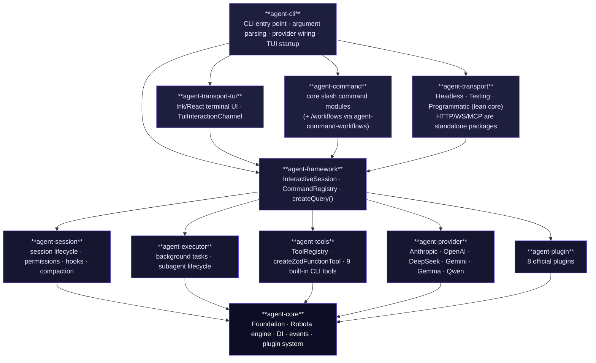

# Architecture

## Layer Structure

Robota SDK follows a strict bottom-up layered assembly model. Each layer builds on the layer below.



## Package Roles

| Package                        | Role                                                                                                                                                                                                                                               | Layer        |
| ------------------------------ | -------------------------------------------------------------------------------------------------------------------------------------------------------------------------------------------------------------------------------------------------- | ------------ |
| **agent-core**                 | Robota engine, execution loop, provider abstraction, permissions, hooks, plugin system, model definitions (SSOT)                                                                                                                                   | Foundation   |
| **agent-tools**                | ToolRegistry, FunctionTool, createZodFunctionTool, 9 built-in CLI tools                                                                                                                                                                            | General      |
| **agent-session**              | Session class with permission enforcement, context tracking, compaction                                                                                                                                                                            | General      |
| **agent-session-analytics**    | Session log timing analysis (LLM wait vs. tool/code time, slow intervals) — new in beta.76                                                                                                                                                         | Analytics    |
| **agent-executor**             | Background task state machines, subagent manager contracts, task snapshots, watchdogs, transcript references                                                                                                                                       | General      |
| **agent-provider**             | Provider packages for Anthropic, OpenAI, OpenAI-compatible primitives, DeepSeek, Gemini, Gemma, Qwen, and more                                                                                                                                     | General      |
| **agent-plugin**               | 8 official plugins: ConversationHistory, Logging, Usage, Limits, ErrorHandling, ExecutionAnalytics, Performance, Webhook                                                                                                                           | General      |
| **agent-command**              | Consolidated slash command package — the core command modules in a single import. `/workflows` ships separately in `agent-command-workflows` (bundled into the CLI)                                                                                | SDK-specific |
| **agent-framework**            | Assembly: InteractiveSession, CommandRegistry, BuiltinCommandSource, SkillCommandSource, config loading, context discovery, skill/agent runtime APIs, createQuery()                                                                                | SDK-specific |
| **agent-transport**            | Lean transport core (pure TS, zero React/Ink): headless (`/headless`), testing (`/testing`), and programmatic (`/programmatic`) sub-paths. HTTP, WebSocket, and MCP are standalone `agent-transport-{http,ws,mcp}` packages (split out in beta.76) | Transport    |
| **agent-transport-tui**        | TUI rendering layer — all Ink/React terminal UI components, `TuiInteractionChannel` (owns session lifecycle), and `useTuiChannel` hook (standalone package since beta.76)                                                                          | Transport    |
| **agent-cli**                  | CLI entry point: argument parsing, provider factory, TUI startup; wires `agent-transport-tui`, `agent-transport`, `agent-command`, `agent-framework`                                                                                               | CLI          |
| **agent-remote-client**        | HTTP client for calling a remote Robota agent exposed via `agent-transport-http`                                                                                                                                                                   | Client       |
| **agent-transport-gui**        | Shared GUI core — React `SessionMonitor` + wire-protocol session reducer (`useWsSession`) over `TServerMessage`                                                                                                                                    | Browser UI   |
| **agent-transport-webrtc-web** | Browser WebRTC peer (`RemoteClient`, `useRtcSession`) rendered over the GUI core                                                                                                                                                                   | Browser UI   |
| **apps/agent-web-monitor**     | CLI-served Vite SPA that hosts the browser session monitor                                                                                                                                                                                         | Browser UI   |
| **agent-interface-transport**  | Transport contract interfaces only (no implementation): `ITransportAdapter`, `IConfigurableTransport`, `ITransportConfig`                                                                                                                          | Contracts    |
| **agent-interface-tui**        | TUI interaction type contracts only: `ITuiCommandInteraction`, `ITuiCliAdapter`, `ITerminalOutput` — no runtime deps                                                                                                                               | Contracts    |

## Dependency Flow

```
agent-cli              ─→ agent-framework, agent-transport-tui, agent-transport, agent-command
agent-transport-tui    ─→ agent-framework, agent-interface-tui, agent-interface-transport, agent-core
agent-transport        ─→ agent-interface-transport, agent-framework, agent-core
agent-command          ─→ agent-core, agent-framework
agent-remote-client                    (HTTP client, no agent-framework dependency)
agent-transport-gui        ─→ agent-interface-transport, agent-transport-protocol (type contracts only)
agent-transport-webrtc-web ─→ agent-transport-gui, agent-remote-pairing, agent-transport-protocol
apps/agent-web-monitor     ─→ agent-transport-gui, agent-transport-webrtc-web
```

## React / Ink Policy

| Category          | Packages allowed                                                                                  | Rule                                        |
| ----------------- | ------------------------------------------------------------------------------------------------- | ------------------------------------------- |
| React + Ink (TUI) | `agent-transport-tui` only                                                                        | Never in protocol transport or SDK packages |
| React (browser)   | `agent-playground`, `agent-transport-gui`, `agent-transport-webrtc-web`, `apps/agent-web-monitor` | Browser app packages only                   |
| Pure TypeScript   | Everything else (core, framework, transport, CLI)                                                 | No React or Ink dependencies                |

## Data Flow: IHistoryEntry[]

`InteractiveSession` maintains history as `IHistoryEntry[]` — a universal timeline that includes both chat messages (user/assistant turns) and session events (tool calls, system events, status changes). This is the single source of truth for display and persistence.

Background tasks are tracked alongside the session through runtime snapshots and append-only JSONL event/transcript streams. High-frequency streaming output is stored in logs/transcripts, while session JSON stores resumable task state and references.

```
User input
  → InteractiveSession.submit()
  → history appended: IHistoryEntry (category: 'chat', role: 'user')
  → Session.run()
  → AI provider receives filtered view (chat-only IHistoryEntry[])
  → streaming response → text_delta / tool_start / tool_end events
  → history appended: IHistoryEntry (category: 'chat', role: 'assistant')
  → event entries appended: IHistoryEntry (category: 'event', ...)
  → thinking / context_update events emitted
  → clients (CLI, HTTP, MCP, WS, Headless) update their state from events
```

Key invariant: AI providers never receive event-kind entries. The session layer filters to chat-only entries before forwarding context to the provider.

Rules:

- Dependencies are one-way. No cycles.
- `agent-core` has zero workspace dependencies (foundation).
- `agent-session` depends only on `agent-core` (generic — no tools or providers).
- Assembly (wiring tools + provider + prompt) happens in `agent-framework`.
- `InteractiveSession` (in `agent-framework`) is the gateway for all transport adapters. There is no separate `IAgentGateway` interface — transports consume `InteractiveSession` directly.
- `agent-cli` and transport packages depend only on `agent-framework`; they do not access `agent-session` or `agent-core` directly.
- `agent-remote-client` is a standalone HTTP client; it does not depend on `agent-framework`.

## Design Patterns

| Pattern         | Where                                                        | Purpose                                       |
| --------------- | ------------------------------------------------------------ | --------------------------------------------- |
| **Facade**      | `Robota`, `Session`, `InteractiveSession`                    | Single entry point hiding internal complexity |
| **Decorator**   | `PermissionEnforcer.wrapTools()`                             | Wraps tools with permission checks            |
| **Strategy**    | `IAIProvider`, `ISessionLogger`                              | Swappable implementations                     |
| **Factory**     | `InteractiveSession`, `createZodFunctionTool()`              | Object creation                               |
| **Null Object** | `SilentLogger`, `DefaultEventService`                        | Safe no-op defaults                           |
| **Registry**    | `ToolRegistry`, `CommandRegistry`                            | Central management of tools and commands      |
| **Composition** | `InteractiveSession` → `Session`; `Session` → sub-components | Delegation over inheritance                   |

## Session Sub-Components

`Session` delegates to focused sub-components:

| Component                | Responsibility                                                      |
| ------------------------ | ------------------------------------------------------------------- |
| `PermissionEnforcer`     | Tool wrapping, permission checks, hook execution, output truncation |
| `ContextWindowTracker`   | Token usage tracking, auto-compact threshold                        |
| `CompactionOrchestrator` | Conversation summarization via LLM (PreCompact hook)                |

## InteractiveSession

`InteractiveSession` (in `agent-framework`) wraps `Session` via composition to provide an event-driven API suitable for any interactive client. It is the single gateway used by all transport adapters — CLI, HTTP, MCP, WebSocket, and Headless.

Key responsibilities:

| Concern               | Detail                                                                                                                           |
| --------------------- | -------------------------------------------------------------------------------------------------------------------------------- |
| **submit / abort**    | `submit(input)` starts a run; `abort()` cancels the current run                                                                  |
| **cancelQueue**       | Cancels the pending queued prompt without aborting the in-flight run                                                             |
| **Prompt queue**      | Queues a new prompt submitted while a run is in progress                                                                         |
| **Event emission**    | Emits typed events (`text_delta`, `tool_start`, `tool_end`, `thinking`, `context_update`, `error`) consumed by clients           |
| **Universal history** | Maintains `IHistoryEntry[]` — unified timeline of chat messages and session events; `getFullHistory()` returns the complete list |
| **CommandRegistry**   | SDK-owned utility used by clients to aggregate built-in, skill, plugin, and command-module sources for slash-command discovery   |

`agent-transport-tui`'s `TuiInteractionChannel` owns the session lifecycle and subscribes to these events, translating them into channel state via `TuiStateManager`. The `useTuiChannel` React hook bridges channel state into `App.tsx`. `InteractiveSession` itself has no React dependency.

## Transport Layer

The transport layer exposes `InteractiveSession` over various protocols. Each transport is a thin adapter that bridges the protocol to the session's `submit` / `abort` / event API.

| Package                      | Protocol                       | Runtime                                        |
| ---------------------------- | ------------------------------ | ---------------------------------------------- |
| **agent-transport-tui**      | Terminal (stdin, Ink TUI)      | Node.js (Ink + React)                          |
| **agent-transport-http**     | HTTP / REST                    | Cloudflare Workers, Node.js, AWS Lambda (Hono) |
| **agent-transport-mcp**      | MCP                            | Node.js stdio / SSE (MCP SDK)                  |
| **agent-transport-ws**       | WebSocket                      | Any WS library (framework-agnostic)            |
| **agent-transport/headless** | stdin/stdout (non-interactive) | Node.js — text/json/stream-json output         |

All adapters import `InteractiveSession` from `agent-framework`. None of them implement session logic — they only translate protocol messages into session calls and forward session events back to the caller.

All transport adapters implement `ITransportAdapter` (defined in `agent-interface-transport`), which provides a uniform lifecycle: `attach(session)` to bind a session, `start()` to begin serving, and `stop()` to shut down.

`agent-remote-client` is a companion HTTP client that allows a remote process to call an agent exposed via `agent-transport-http`. It has no dependency on `agent-framework`.

## Plugin Architecture

`agent-core` defines the `AbstractPlugin` base class. 8 plugin implementations are available in `@robota-sdk/agent-plugin`.

Plugins integrate with the agent lifecycle via hooks: `beforeRun`, `afterRun`, `onError`, `onStreamChunk`, `beforeToolExecution`, `afterToolExecution`.

## Changes from v2.0.0

In v2.0.0, `agent-core` contained everything: tools, plugins, session management. In v3.0.0:

- **Tools** moved to `agent-tools` (FunctionTool, ToolRegistry, built-in tools)
- **Plugins** consolidated in `@robota-sdk/agent-plugin`
- **Session** created as `agent-session` with permission and hook support
- **Background tasks** handled by `agent-executor`
- **SDK assembly** in `agent-framework`
- **CLI** entry point is `agent-cli`
- **TUI** (Ink/React) in the standalone `agent-transport-tui` package
- **Transport** (protocol-only) in `agent-transport` (lean core) + `agent-transport-{http,ws,mcp}`
- **Permissions** and **Hooks** added to `agent-core` as general-purpose infrastructure
