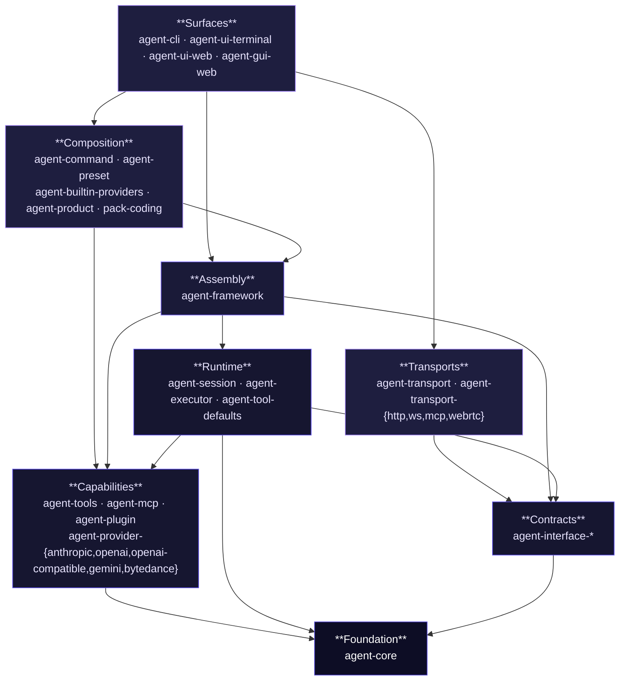

# Architecture

Robota is a collection of TypeScript packages, not one framework you adopt whole. Each package owns
one concern, and packages are stacked in layers so that a package only ever depends on the layers
beneath it. This page explains what the layers are, why they are separate, and how a request moves
through them. The repository-level summary is in [`ARCHITECTURE.md`](../../ARCHITECTURE.md); each
package's contract is in its `docs/SPEC.md`.

## Why the layers exist

- **Use as little as you need.** `@robota-sdk/agent-core` runs an agent on its own. You add the
  session runtime, the assembly layer, a transport or a UI only when you need them, and you install
  only the provider packages you actually call.
- **Swap parts without touching the core.** Providers, tools, transports and user interfaces plug
  into contracts that the lower layers define. Adding a vendor or a protocol is a new package, not an
  edit to the engine.
- **Keep implementations independent.** Shared types live in contract-only packages
  (`agent-interface-*`). A transport can talk to a session through those contracts without
  depending on the package that builds sessions.
- **Keep product opinions at the edge.** Library packages stay neutral: they read no ambient config
  and pick no file locations on their own. The `robota` CLI is one application built on top of them,
  and it is where product decisions (which settings files to read, which commands to offer) live.

## The layers

Arrows point from a package to what it depends on. The diagram groups packages; the tables below
list the exact members.


```mermaid
flowchart TB
    SURF["**Surfaces**\nagent-cli · agent-ui-terminal · agent-ui-web · agent-gui-web"]
    TRANS["**Transports**\nagent-transport · agent-transport-{http,ws,mcp,webrtc}"]
    COMP["**Composition**\nagent-command · agent-preset\nagent-builtin-providers · agent-product · pack-coding"]
    FW["**Assembly**\nagent-framework"]
    RT["**Runtime**\nagent-session · agent-executor · agent-tool-defaults"]
    CAP["**Capabilities**\nagent-tools · agent-mcp · agent-plugin\nagent-provider-{anthropic,openai,openai-compatible,gemini,bytedance}"]
    IF["**Contracts**\nagent-interface-*"]
    CORE["**Foundation**\nagent-core"]

    SURF --> TRANS
    SURF --> COMP
    SURF --> FW
    COMP --> FW
    COMP --> CAP
    TRANS --> IF
    FW --> RT
    FW --> CAP
    FW --> IF
    RT --> IF
    RT --> CAP
    CAP --> CORE
    RT --> CORE
    IF --> CORE

    classDef edge fill:#1e1e3f,stroke:#a78bfa,color:#e8e4ff
    classDef framework fill:#1a1a38,stroke:#7c6bf7,color:#e8e4ff
    classDef general fill:#161630,stroke:#5a4de6,color:#e8e4ff
    classDef core fill:#0d0d25,stroke:#4f44d0,color:#fff

    class SURF,TRANS,COMP edge
    class FW framework
    class RT,CAP,IF general
    class CORE core
```

### Foundation — `agent-core`

`agent-core` contains the `Robota` agent class and its execution loop (model call, tool calls,
repeat), the provider abstraction (`IAIProvider`, `AbstractAIProvider`), the tool registry
(`FunctionTool`, `ToolRegistry`), the plugin base class (`AbstractPlugin`), permission evaluation,
hook execution, context-window accounting, model metadata, and the typed error classes.

It has no dependency on any other Robota package. Everything else registers with it through its
abstract contracts, so it can be used alone and nothing can form a dependency cycle through it.
Node-only helpers are on a separate `@robota-sdk/agent-core/node` entry point so that the main entry
also works in a browser.

### Contracts — `agent-interface-*`

| Package                            | Contracts it owns                                                           |
| ---------------------------------- | --------------------------------------------------------------------------- |
| `agent-interface-session`          | Interactive sessions, session events, turns, persistence records            |
| `agent-interface-command`          | Commands, command results, command modules, capability descriptors          |
| `agent-interface-execution`        | Background tasks, job groups, subagent jobs, execution workspaces           |
| `agent-interface-transport`        | Transport adapters (`ITransportAdapter`) and transport configuration        |
| `agent-interface-session-mobility` | Moving a session between processes and devices                              |
| `agent-interface-analytics`        | Usage snapshots, per-source totals, run-trace timelines                     |
| `agent-interface-tui`              | Terminal command interactions (pickers, confirmations, missing-arg prompts) |

These packages hold types, not behavior. An interface package depends only on `agent-core` and on
lower interface packages, never on an implementation. That is what lets, for example, every
transport accept a session without depending on `agent-framework`.

### Capabilities — providers, tools, MCP, plugins

| Package                                 | What it provides                                                                      |
| --------------------------------------- | ------------------------------------------------------------------------------------- |
| `agent-provider-anthropic`              | Anthropic Claude                                                                      |
| `agent-provider-openai`                 | OpenAI                                                                                |
| `agent-provider-openai-compatible`      | DeepSeek, Qwen, and Gemma-family models behind OpenAI-compatible endpoints            |
| `agent-provider-gemini`                 | Google Gemini                                                                         |
| `agent-provider-bytedance`              | ByteDance (ModelArk) video generation                                                 |
| `agent-tools`                           | Tool factories (`createZodFunctionTool`, `createFunctionTool`) and the built-in tools |
| `agent-mcp`                             | Model Context Protocol client: server definitions, activation, OAuth sign-in          |
| `agent-plugin`                          | Eight ready-made plugins (logging, usage, limits, webhooks, and more)                 |
| `agent-process`, `agent-file-authority` | Small helpers: process-tree termination, bounded root-relative file reads             |
| `agent-session-analytics`               | Session-log timing and usage analysis, reports and OTLP export                        |
| `agent-remote-pairing`                  | Pairing and channel binding for peer-to-peer connections (no Robota dependencies)     |

Each provider package is a leaf over `agent-core` (the OpenAI package also reuses
`agent-provider-openai-compatible`), so a vendor SDK is installed only by the package that needs
it. `agent-plugin` depends only on `agent-core`; plugins attach to the engine and never reach into
the layers above it.

### Runtime — `agent-session`, `agent-executor`, `agent-tool-defaults`

`agent-session` wraps a `Robota` instance in a `Session`: tool calls pass through permission checks
and hooks, context usage is tracked, the conversation is compacted when it grows too large, and
records can be persisted through a store port. It receives its provider and tools already built;
it never constructs them.

`agent-executor` provides background-task lifecycles (queueing, cancellation, snapshots) and the
subagent job ports.

`agent-tool-defaults` holds `createDefaultTools()`, the default tool set (built on `agent-tools`).
`agent-framework` loads it lazily when it assembles a session, and a caller replaces it by passing its
own `defaultTools`; a library that needs only the tool mechanism depends on `agent-tools` and never
pulls in the default catalog.

### Assembly — `agent-framework`

`agent-framework` puts the lower layers together into a ready-to-use session. Its entry points are
`InteractiveSession`, `createQuery()` and `createAgentRuntime()`. It also owns config and context
loading, workspace trust, the command registry, skills, subagent assembly, and the headless and
programmatic runners.

It is provider-neutral — you construct the provider and pass it in — and it contains no React or
Ink. It reads only the files and directories its host passes to it: without an explicit decision it
loads no user settings, no project instructions and no project skills. See
[Using the SDK](./sdk.md).

### Composition — defaults, presets, commands, packs

| Package                   | Role                                                                              |
| ------------------------- | --------------------------------------------------------------------------------- |
| `agent-builtin-providers` | `createDefaultProviderDefinitions()` — the built-in chat provider definitions     |
| `agent-command`           | The slash-command modules (`/help`, `/compact`, `/permissions`, and the rest)     |
| `agent-preset`            | Named bundles of session options (persona, model, permission posture)             |
| `agent-capability-pack`   | `ICapabilityPack` and `mergeCapabilityPacks()` for adding tools, commands, agents |
| `pack-coding`             | `createCodingPack()` — the coding tools, commands and subagents as one pack       |
| `agent-product`           | `assembleProduct()` — builds a product from a declarative profile                 |
| `agent-subagent-runner`   | Optional runner that executes subagents in child processes                        |

These packages are meant to be imported where an application is put together (its "composition
root"), not by libraries in the middle of the stack, so a library that only needs the mechanisms
never drags in these defaults.

### Transports

| Package                  | Protocol                                                        |
| ------------------------ | --------------------------------------------------------------- |
| `agent-transport`        | Carrier-neutral wire messages, decoders and delivery helpers    |
| `agent-transport-http`   | HTTP, built on Hono                                             |
| `agent-transport-ws`     | WebSocket                                                       |
| `agent-transport-mcp`    | Exposes a session as an MCP server (stdio and Streamable HTTP)  |
| `agent-transport-webrtc` | Peer-to-peer WebRTC data channels (remote control, device mesh) |

A transport is a thin adapter: it turns protocol messages into session calls (submit, abort,
commands, permission answers) and sends session events back. Transports implement
`ITransportAdapter` from `agent-interface-transport` and depend on the session contracts, not on
`agent-framework`. `agent-framework` itself provides the non-interactive runner (`text`, `json` or
`stream-json` output) and the `TransportRegistry` that starts and stops several transports
together. See [Deployment](./deployment.md).

### Surfaces

| Package                                 | What it is                                                                       |
| --------------------------------------- | -------------------------------------------------------------------------------- |
| `agent-ui-terminal`                     | The terminal UI (React + Ink), including `renderApp` and `TuiInteractionChannel` |
| `agent-cli`                             | The `robota` command — a reference application built from the packages above     |
| `agent-ui-web` (internal)               | GUI components and a session reducer over the transport wire protocol            |
| `agent-gui-web` (internal)              | The GUI web app served by `robota --serve --open` and loaded by the desktop app  |
| `agent-transport-webrtc-web` (internal) | The browser side of a WebRTC remote-control connection                           |

`agent-cli` bundles the Robota packages it uses into its own build, so installing it does not
install the SDK packages separately. The desktop app (`apps/agent-app`) is an Electron shell: it
starts or reuses the workspace's `robota` daemon, connects to it over loopback, and loads
`agent-gui-web`.

React and Ink appear only in these surface packages: Ink in `agent-ui-terminal` (and `agent-cli`,
which bundles it), React in the terminal and web UI packages. Every other package is plain
TypeScript.

### Internal packages

Some packages are marked `private` and are not published to npm: the DAG workflow engine
(`dag-*`) and `agent-command-workflows`, which together power the CLI's `/workflows` command and are
bundled into `agent-cli`; the web UI packages above; and `agent-provider-replay`, a provider that
replays a recorded session for offline tests.

## Dependency rules

These rules keep the layering real rather than aspirational (the full list is in
[`ARCHITECTURE.md`](../../ARCHITECTURE.md)):

- Dependencies point one way, down the layers. There are no cycles.
- `agent-core` depends on no other Robota package.
- An `agent-interface-*` package depends only on `agent-core` and lower interface packages.
- Plugin packages depend only on `agent-core`.
- `agent-framework` and `agent-core` never depend on a transport or UI package.
- No package re-exports another package wholesale; you import a symbol from the package that owns it.

## How a turn flows

`InteractiveSession` records everything that happens in one ordered history of `IHistoryEntry`
items. An entry's `category` is `'chat'` for user and assistant messages and `'event'` for things
such as tool starts and ends. The same history drives display and persistence.

```
User input
  → InteractiveSession.submit()
  → history: IHistoryEntry (category 'chat', user message)
  → Session.run() → Robota.run()
  → the provider receives only the chat entries, converted to messages
  → streaming reply → text_delta events; tool calls → tool_start / tool_end events
  → history: assistant message (category 'chat') and tool entries (category 'event')
  → context_update, then complete (or interrupted / error)
  → every attached client (terminal, web GUI, HTTP, WebSocket, MCP) updates from the events
```

The provider never sees event entries; the session filters the history to chat messages before each
model call. Background tasks are tracked beside the session as task snapshots and append-only
transcripts, so a long-running task's output does not rewrite the session record on every chunk.

`Session` delegates to focused components: `PermissionEnforcer` wraps each tool with permission
checks and hooks, `ContextWindowTracker` tracks token usage and the auto-compaction threshold, and
`CompactionOrchestrator` summarizes the conversation when it is compacted. See
[Context Management](./context-management.md).

## Plugins

`agent-core` defines `AbstractPlugin`; `@robota-sdk/agent-plugin` provides eight implementations.
A plugin overrides the lifecycle hooks it cares about, such as `beforeRun`, `afterRun`,
`beforeProviderCall`, `afterProviderCall` and `onError`. A failing hook is logged and does not fail
the run. The hook list and examples are in [Building Agents](./building-agents.md#plugins).

## Design patterns

| Pattern         | Where                                                              | Purpose                                          |
| --------------- | ------------------------------------------------------------------ | ------------------------------------------------ |
| **Facade**      | `Robota`, `Session`, `InteractiveSession`                          | One entry point over many internal parts         |
| **Decorator**   | `PermissionEnforcer.wrapTools()`                                   | Adds permission checks around each tool          |
| **Strategy**    | `IAIProvider`, `ISessionLogger`                                    | Swappable implementations                        |
| **Factory**     | `createQuery()`, `createAgentRuntime()`, `createZodFunctionTool()` | Build configured objects                         |
| **Null Object** | `SilentLogger`, `DefaultEventService`                              | Safe do-nothing defaults                         |
| **Registry**    | `ToolRegistry`, `CommandRegistry`, `TransportRegistry`             | One place to look up tools, commands, transports |
| **Composition** | `InteractiveSession` → `Session` → `Robota`                        | Delegation instead of inheritance                |
