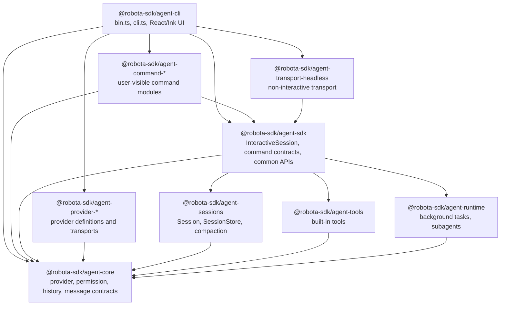
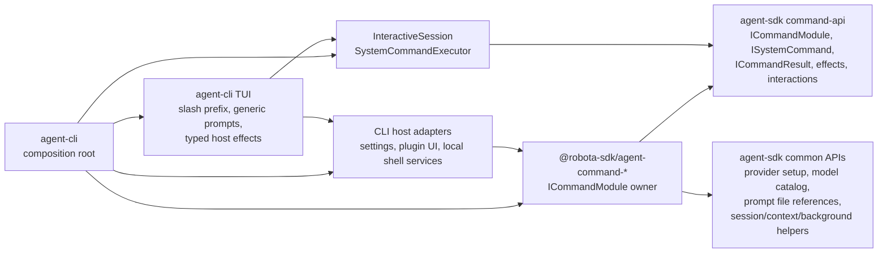
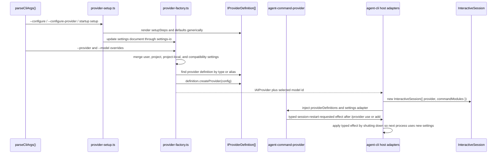
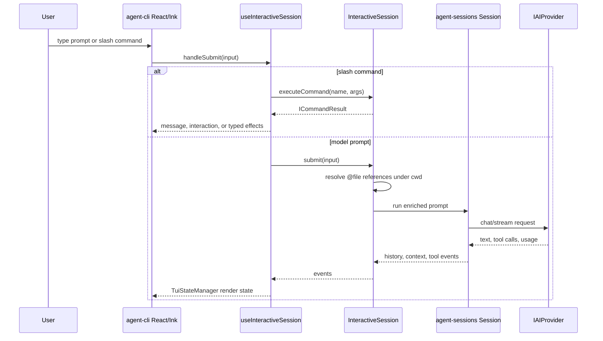
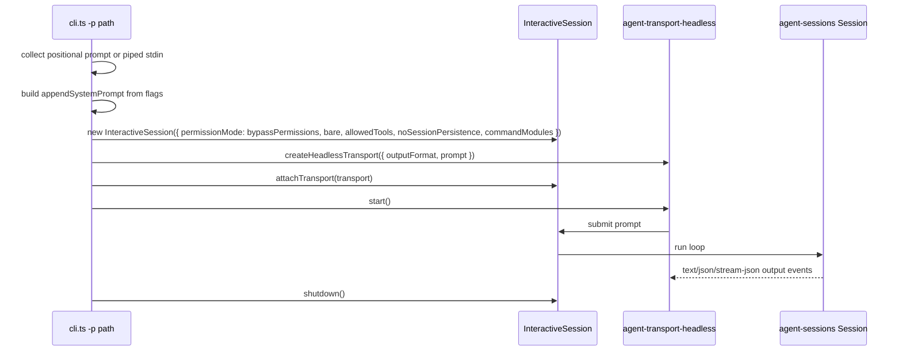

# Agent CLI Architecture Map

Source-verified against `develop` commit `6c05ddd04` and the
`feat/cli-at-file-reference-import` working tree on 2026-05-05.

This document is the LLM-scannable master map for how `@robota-sdk/agent-cli` is
assembled. Package `SPEC.md` files remain the source of truth for ownership
contracts; this map shows the actual composition path and records layer audit
findings that should be fixed in follow-up work.

## Reading Order

1. Start with [Package Dependency Graph](#package-dependency-graph) for allowed edges.
2. Read [CLI Composition Tree](#cli-composition-tree) for the concrete startup path.
3. Use [Built-in Command Layer](#built-in-command-layer) before changing any slash command.
4. Use [Provider and Model State Flow](#provider-and-model-state-flow) before changing setup,
   `/provider`, or `/model`.
5. Use [Target Architecture](#target-architecture) before adding a new package edge, facade,
   adapter, or command host contract.
6. Use [Layering Audit](#layering-audit) before deciding whether a concern belongs in CLI, SDK,
   a command package, provider package, runtime, sessions, or core.

## Target Architecture

The CLI target is a thin product shell around SDK-hosted session orchestration and command
contracts. `agent-cli` may compose product defaults and own terminal-specific adapters, but reusable
runtime behavior, command behavior, provider semantics, and persistence contracts must be owned by
the package whose public API describes that behavior.

```text
agent-cli
  owns terminal input/rendering, CLI flags, provider definition composition,
  product-default command module selection, and concrete local host adapters
      |
      v
agent-sdk
  owns InteractiveSession, command contracts/common APIs, provider-neutral facades,
  host adapter ports, prompt file-reference preprocessing, session orchestration,
  and SDK-specific safety layers
      |
      +--> agent-sessions   owns conversation run loop, persistence, compaction
      +--> agent-runtime    owns reusable background/subagent lifecycle ports and state
      +--> agent-tools      owns generic tools and tool schemas
      +--> agent-core       owns provider, history, permission, hook, and model catalog contracts

agent-command-*
  owns user-visible command descriptors and execution; consumes SDK contracts as a third-party
  command module would

agent-provider-*
  owns provider definitions, defaults, setup metadata, fallback model catalogs, probes, transport
  translation, and provider-specific options
```

Target ownership rules:

| Concern                                                      | Target owner                                  | CLI role                                                              |
| ------------------------------------------------------------ | --------------------------------------------- | --------------------------------------------------------------------- |
| Slash prefix detection, command autocomplete, prompt UI      | `agent-cli`                                   | Render and route generic command requests.                            |
| Command descriptors, command execution, lifecycle effects    | `agent-command-*`                             | Select default modules and render returned interactions/effects.      |
| Command contracts, result/effect types, host adapter ports   | `agent-sdk`                                   | Consume SDK contracts without defining parallel command shapes.       |
| Provider settings/profile setup common APIs                  | `agent-sdk` + provider packages               | Provide concrete settings adapters and provider definitions.          |
| Prompt `@file` parsing, file reads, diagnostics, records     | `agent-sdk`                                   | Pass ordinary prompt text through `InteractiveSession.submit()`.      |
| Provider-specific defaults, probes, model fallback data      | `agent-provider-*` via `agent-core` contracts | Compose definitions, never branch on provider names in TUI hooks.     |
| Session persistence facade                                   | `agent-sdk`                                   | Request project-local store and display SDK-owned summaries.          |
| Reusable background/subagent state machines and ports        | `agent-runtime`                               | Supply local process/worktree adapters when they are terminal-hosted. |
| Terminal process spawning, Ink rendering, local settings I/O | `agent-cli`                                   | Keep concrete I/O at the outer shell.                                 |
| Core provider/history/permission/model contracts             | `agent-core`                                  | Import public contracts only.                                         |

Target migration order:

1. Remove implicit command effect transport through mutable `InteractiveSession` fields.
2. Retire CLI command compatibility shims so consumers import command infrastructure from the SDK
   owner directly.
3. Keep local runtime adapters classified: reusable lifecycle, log pagination, and worktree
   contracts stay behind SDK/runtime-owned ports; CLI keeps only terminal-host I/O.
4. Add provider model catalog live/generated refresh adapters on top of the existing provider-owned
   fallback catalog contract.
5. Audit the SDK public export surface so owned APIs and compatibility re-exports are explicit and
   do not hide package ownership.

## Package Dependency Graph



| Edge                                     | Status                | Rule                                                                                                                                        |
| ---------------------------------------- | --------------------- | ------------------------------------------------------------------------------------------------------------------------------------------- |
| CLI -> SDK                               | Allowed               | CLI consumes `InteractiveSession`, command registries, command contracts, SDK path helpers, and SDK-owned session persistence facade types. |
| CLI -> command packages                  | Allowed               | Product composition root selects default command modules.                                                                                   |
| CLI -> provider packages                 | Allowed               | CLI owns provider definition composition and provider instance creation.                                                                    |
| CLI -> agent-core public types           | Allowed               | CLI may use public provider, permission, history, and message types.                                                                        |
| CLI -> headless transport                | Allowed               | Print mode attaches a transport to `InteractiveSession`.                                                                                    |
| CLI -> agent-sessions                    | Forbidden by CLI SPEC | No production source or package dependency should exist; harness command layering scan enforces this edge.                                  |
| SDK -> command packages                  | Forbidden             | SDK owns contracts/common APIs and must not import command implementations. No source edge found.                                           |
| command packages -> CLI/TUI              | Forbidden             | Commands consume SDK contracts and host adapters only. No source edge found.                                                                |
| provider packages -> Robota commands/TUI | Forbidden             | Providers translate provider wire formats only. No source edge found in this audit.                                                         |

## CLI Composition Tree

```text
packages/agent-cli/src/bin.ts
`- startCli() from src/cli.ts
   |- parseCliArgs()
   |- readVersion(), update-check flags, reset/configure flags
   |- build commandHostAdapters
   |  |- settings adapter -> settings-io.ts
   |  `- plugin adapter -> plugins/plugin-command-adapter.ts
   |- providerDefinitions = DEFAULT_PROVIDER_DEFINITIONS
   |  |- agent-provider-anthropic
   |  |- agent-provider-openai
   |  |- agent-provider-gemini
   |  |- agent-provider-gemma
   |  `- agent-provider-qwen
   |- commandModules
   |  |- createHelpCommandModule()
   |  |- createAgentCommandModule()
   |  |- createModelCommandModule()
   |  |- createModeCommandModule()
   |  |- createPermissionsCommandModule()
   |  |- createLanguageCommandModule()
   |  |- createBackgroundCommandModule()
   |  |- createMemoryCommandModule()
   |  |- createCompactCommandModule()
   |  |- createContextCommandModule()
   |  |- createExitCommandModule()
   |  |- createSessionCommandModule()
   |  |- createResetCommandModule()
   |  |- createRewindCommandModule()
   |  |- createStatusLineCommandModule()
   |  |- createPluginCommandModule()
   |  |- createProviderCommandModule({ providerDefinitions, settings adapter })
   |  `- options.commandModules
   |- ensureConfig() / provider setup
   |- readProviderSettings() and createProviderFromSettings()
   |- create runtime adapters
   |  |- managed shell background runner
   |  `- child-process subagent runner factory
   |- createProjectSessionStore(cwd) from SDK for resume/persistence facade
   |- if -p print mode
   |  |- new InteractiveSession({ cwd, provider, commandModules, commandHostAdapters, ... })
   |  |- createHeadlessTransport({ outputFormat, prompt })
   |  |- session.attachTransport(transport)
   |  `- transport.start(); session.shutdown()
   `- otherwise interactive mode
      `- renderApp()
         `- App.tsx
            |- useInteractiveSession()
            |  |- new InteractiveSession({ cwd, provider, commandModules, commandHostAdapters, ... })
            |  |- CommandRegistry
            |  |- CommandEffectQueue
            |  |- createBuiltinCommandModule()
            |  |- register injected command modules
            |  |- SkillCommandSource
            |  |- PluginCommandSource reload
            |  `- TuiStateManager event bridge
            |- useSlashRouting()
            |  |- non-slash input -> interactiveSession.submit()
            |  |- slash input -> interactiveSession.executeCommand()
            |  `- skill/plugin fallback -> executeSkillCommand()
            |- useSideEffects()
            |  |- render generic ICommandInteraction prompts
            |  `- apply typed TCommandEffect values
            `- Ink renderers
               |- MessageList
               |- InputArea
               |- SessionStatusBar / StatusBar
               |- PermissionPrompt
               |- InteractivePrompt
               |- ConfirmPrompt
               |- PluginTUI
               `- SessionPicker
```

## Built-in Command Layer

Built-in commands are product-default command modules. They are not SDK-owned
business logic and they are not CLI/TUI feature code.



| Responsibility                                                         | Owner                                                       |
| ---------------------------------------------------------------------- | ----------------------------------------------------------- |
| Slash prefix detection and unknown-command rendering                   | `agent-cli`                                                 |
| Command metadata, subcommands, lifecycle policy, interactions, effects | Owning `agent-command-*` package                            |
| Command contracts, registry, executor, effect/interactions types       | `agent-sdk`                                                 |
| Reusable command common APIs and ports                                 | `agent-sdk/src/command-api/*`                               |
| Prompt `@file` parsing, workspace-bound resolution, diagnostics        | `agent-sdk/src/context/prompt-file-reference-*.ts`          |
| Context reference inventory and manual reference state                 | `agent-sdk/src/context/context-reference-inventory.ts`      |
| Host persistence, local process actions, UI shell actions              | `agent-cli` host adapters and TUI effect handlers           |
| Provider setup semantics for `/provider`                               | `agent-command-provider` consuming SDK provider common APIs |
| Model-change request semantics for `/model`                            | `agent-command-model` consuming SDK model common APIs       |

Forbidden shortcuts:

- A command package must not import `agent-cli` or React/Ink code.
- `agent-sdk` must not import or special-case `agent-command-*` packages.
- CLI hooks must not reimplement command-specific setup flows when a command module can own them.
- Provider packages must not know slash commands, command names, TUI behavior, or Robota workflow semantics.

## Provider and Model State Flow



Settings ownership:

- `agent-cli` owns concrete settings file paths and provider instance construction.
- `agent-command-provider` owns `/provider` command semantics and settings patches.
- `agent-sdk` owns common provider settings/setup/probe APIs used by command modules.
- Provider packages own defaults, setup metadata, validation requirements, aliases, probes, options, and `createProvider()`.

Current model catalog state:

- `/model` is supplied by `@robota-sdk/agent-command-model`.
- The command consumes SDK model command common APIs.
- Active-provider model choices resolve through `IProviderDefinition.modelCatalog` metadata owned by
  provider packages and the SDK model command common API.
- Provider definitions include conservative fallback catalog metadata with source URLs and
  verification timestamps where the provider has known defaults.
- Live/generated catalog refresh adapters are not implemented yet; that is a follow-up architecture
  task, not a TUI concern.

## Execution Modes

### Interactive TUI



Interactive mode currently supports:

- permission prompts through CLI React state and SDK permission handler injection;
- `/` command execution through `InteractiveSession.executeCommand()`;
- generic `ICommandInteraction` rendering;
- typed `TCommandEffect` application;
- skill and plugin command discovery through SDK command sources;
- prompt `@file` references through SDK-owned preprocessing, with CLI only passing submitted text;
- session resume/fork/name flows through SDK-owned session persistence facade and summaries.

### Non-Interactive Print Mode



Current `develop` print mode supports `-p`, piped stdin, `--output-format`,
`--permission-mode`, `--max-turns`, `--bare`, `--allowed-tools`,
`--no-session-persistence`, `--append-system-prompt`, and `--json-schema`.

`--task-file` is not present in current `develop`; if that flag is merged from another branch,
this section must be updated in the same PR.

## Class and Interface Inventory

| Item                             | Owner                                                       | Layer                      | Inbound consumers                           | Outbound dependencies                                                | Responsibility                                                                               |
| -------------------------------- | ----------------------------------------------------------- | -------------------------- | ------------------------------------------- | -------------------------------------------------------------------- | -------------------------------------------------------------------------------------------- |
| `startCli()`                     | `agent-cli/src/cli.ts`                                      | Product shell              | binary entrypoint, embedders                | SDK, command packages, providers, headless transport, settings I/O   | Parse flags, compose providers/modules/adapters, choose interactive or print mode.           |
| `renderApp()`                    | `agent-cli/src/ui/render.tsx`                               | UI shell                   | `startCli()`                                | React, Ink, `App`                                                    | Start Ink app and process exit handling.                                                     |
| `App` / `AppInner`               | `agent-cli/src/ui/App.tsx`                                  | UI shell                   | `renderApp()`                               | CLI hooks and components                                             | Compose TUI state, prompts, plugin UI, session picker, status bar.                           |
| `useInteractiveSession()`        | `agent-cli/src/ui/hooks/useInteractiveSession.ts`           | React-SDK bridge           | `AppInner`                                  | `InteractiveSession`, `CommandRegistry`, `TuiStateManager`           | Create the SDK session once and subscribe SDK events to render state.                        |
| `useSlashRouting()`              | `agent-cli/src/ui/hooks/useSlashRouting.ts`                 | UI command routing         | `useInteractiveSession()`                   | `InteractiveSession`, `CommandRegistry`                              | Parse leading slash, call SDK command execution, route skill/plugin fallback.                |
| `useSideEffects()`               | `agent-cli/src/ui/hooks/useSideEffects.ts`                  | UI effect application      | `AppInner`                                  | CLI settings/UI adapters, `InteractiveSession`, `CommandEffectQueue` | Render generic interactions and apply typed command effects.                                 |
| `CommandEffectQueue`             | `agent-cli/src/ui/hooks/command-effect-queue.ts`            | UI command result boundary | `useSlashRouting()`, `useSideEffects()`     | SDK command interaction/effect types                                 | Explicit CLI-owned queue for command interactions and host effects returned by SDK commands. |
| `TuiStateManager`                | `agent-cli/src/ui/tui-state-manager.ts`                     | UI state projection        | `useInteractiveSession()`                   | agent-core history/context types                                     | Convert SDK events into stable render state.                                                 |
| `ICommandModule`                 | `agent-sdk/src/command-api/command-module.ts`               | SDK command contract       | command packages, CLI, SDK executor         | agent-sdk command API                                                | Module boundary for command sources, system commands, descriptors, requirements.             |
| `ICommandResult`                 | `agent-sdk/src/command-api/command-result.ts`               | SDK command contract       | command packages, SDK, CLI                  | command effects/interactions                                         | Structured command output consumed by generic hosts.                                         |
| `TCommandEffect`                 | `agent-sdk/src/command-api/effects.ts`                      | SDK command contract       | command packages, CLI effect handlers       | agent-core end reason types                                          | Typed host-side work requested by commands.                                                  |
| `CommandRegistry`                | `agent-sdk/src/commands/command-registry.ts`                | SDK command infrastructure | CLI, tests                                  | `ICommandSource`                                                     | Aggregate command palette entries from modules, skills, and plugins.                         |
| `BuiltinCommandSource`           | `agent-sdk/src/commands/builtin-source.ts`                  | SDK command infrastructure | CLI, SDK tests                              | SDK command API                                                      | Expose SDK-default built-ins; currently empty.                                               |
| `SystemCommandExecutor`          | `agent-sdk/src/commands/system-command-executor.ts`         | SDK command infrastructure | `InteractiveSession`                        | `ISystemCommand`                                                     | Execute matching system command with SDK host context.                                       |
| `InteractiveSession`             | `agent-sdk/src/interactive/interactive-session.ts`          | SDK entrypoint             | CLI, command tests, SDK consumers           | sessions, runtime, tools, core, command API                          | Event-driven wrapper over `Session`, prompt queueing, command execution, persistence.        |
| `resolvePromptFileReferences()`  | `agent-sdk/src/context/prompt-file-reference-*.ts`          | SDK context common API     | `InteractiveSession`, SDK consumers         | Node filesystem/path APIs                                            | Parse path-like `@file` tokens, read bounded workspace-local files, and return diagnostics.  |
| `listCommandContextReferences()` | `agent-sdk/src/command-api/context/context-command-api.ts`  | SDK command common API     | `agent-command-context`, SDK consumers      | SDK context reference inventory                                      | Expose context reference inventory to command packages without CLI/TUI ownership.            |
| `createProjectSessionStore()`    | `agent-sdk/src/interactive/session-persistence.ts`          | SDK facade                 | CLI, SDK consumers                          | agent-sessions, project paths                                        | Create project-local `.robota/sessions` persistence without exposing `SessionStore` to CLI.  |
| `IResumableSessionSummary`       | `agent-sdk/src/interactive/session-persistence.ts`          | SDK facade type            | CLI session picker, SDK consumers           | none                                                                 | Host-facing saved-session list item with id/name/cwd/update time/message count/preview.      |
| `createInteractiveSession()`     | `agent-sdk/src/interactive/interactive-session-init.ts`     | SDK assembly               | `InteractiveSession`                        | config/context, plugin hooks, `createSession()`                      | Load config/context/project data and construct `Session`.                                    |
| `createSession()`                | `agent-sdk/src/assembly/create-session.ts`                  | SDK assembly               | `createInteractiveSession()`, SDK tests     | sessions, tools, runtime, core                                       | Assemble provider, tools, system prompt, command tool, background/subagent runtime.          |
| `Session`                        | `agent-sessions`                                            | Session runtime            | SDK assembly                                | agent-core                                                           | Run conversation lifecycle, permissions, compaction, context tracking.                       |
| `SessionStore`                   | `agent-sessions`                                            | Session persistence        | SDK facade and generic session consumers    | filesystem                                                           | Persist/resume session JSON behind `ISessionStore`. CLI must not consume it directly.        |
| `IProviderDefinition`            | `agent-core`                                                | Core/provider contract     | provider packages, CLI, provider command    | core provider config types                                           | Provider defaults, setup metadata, aliases, probes, factory.                                 |
| `createProviderFromSettings()`   | `agent-cli/src/utils/provider-factory.ts`                   | CLI provider composition   | `startCli()`                                | provider definitions, settings I/O                                   | Resolve effective provider settings and instantiate provider.                                |
| `createProviderCommandModule()`  | `agent-command-provider`                                    | Command package            | CLI composition                             | SDK command and provider common APIs                                 | Own `/provider` metadata, setup interactions, settings patches, restart effects.             |
| `createModelCommandModule()`     | `agent-command-model`                                       | Command package            | CLI composition                             | SDK model common API                                                 | Own `/model` metadata and model-change effects.                                              |
| `createAgentCommandModule()`     | `agent-command-agent`                                       | Command package            | CLI composition                             | SDK command/runtime APIs                                             | Own `/agent` metadata and background agent command execution.                                |
| `executeSkill()`                 | `agent-sdk/src/commands/skill-executor.ts`                  | SDK command infrastructure | `InteractiveSession`, SDK tests             | SDK skill prompt utilities                                           | Process skill prompts for fork/inject execution paths behind SDK session APIs.               |
| `ManagedShellProcessRunner`      | `agent-cli/src/background/managed-shell-process-runner.ts`  | Local runtime adapter      | `startCli()` runtime composition            | Node child process APIs, SDK-reexported runtime ports/log helpers    | Terminal-hosted background process runner implementation.                                    |
| `ChildProcessSubagentRunner`     | `agent-cli/src/subagents/child-process-subagent-runner.ts`  | Local runtime adapter      | `startCli()` runtime composition            | CLI IPC/transport/worker helpers, SDK subagent/log contracts         | Spawn isolated child-process subagent jobs for the CLI host.                                 |
| `GitWorktreeIsolationAdapter`    | `agent-cli/src/subagents/git-worktree-isolation-adapter.ts` | Local runtime adapter      | child-process subagent runner tests/runtime | Git CLI, filesystem, SDK-reexported runtime worktree port            | Prepare and clean worktree isolation for local subagent execution.                           |
| `createHeadlessTransport()`      | `agent-transport-headless`                                  | Transport                  | CLI print mode                              | SDK transport contract                                               | Drive non-interactive prompt input and output formatting.                                    |

## Layering Audit

### CLI-AUDIT-001: CLI imports `agent-sessions` directly

Status: resolved in PR #205.

Former files:

- `packages/agent-cli/src/cli.ts`
- `packages/agent-cli/src/ui/render.tsx`
- `packages/agent-cli/src/ui/App.tsx`
- `packages/agent-cli/src/ui/hooks/useInteractiveSession.ts`
- `packages/agent-cli/src/ui/SessionPicker.tsx`
- `packages/agent-cli/package.json`

Problem:

`packages/agent-cli/docs/SPEC.md` says CLI must not import from
`@robota-sdk/agent-sessions`, but the CLI creates and passes `SessionStore` directly.

Resolution:

Session persistence construction and the public resume/picker data contract now live behind
SDK-owned APIs in `agent-sdk/src/interactive/session-persistence.ts`. CLI calls
`createProjectSessionStore(cwd)`, `resolveLatestSessionId()`, `resolveSessionIdByIdOrName()`, and
`listResumableSessionSummaries()` from `@robota-sdk/agent-sdk`; it does not import
`@robota-sdk/agent-sessions` or declare it in `packages/agent-cli/package.json`.

Mechanical guard:

- `scripts/harness/check-command-layering.mjs` flags production CLI imports from
  `@robota-sdk/agent-sessions` and direct CLI package dependencies on it.

### CLI-AUDIT-002: TUI command effects were queued by mutating `InteractiveSession`

Status: resolved in `fix/cli-command-effect-boundary`.

Current files:

- `packages/agent-cli/src/ui/hooks/useSlashRouting.ts`
- `packages/agent-cli/src/ui/hooks/useSideEffects.ts`
- `packages/agent-cli/src/ui/hooks/side-effects-types.ts`
- `packages/agent-cli/src/ui/__tests__/slash-routing-effects.test.ts`

Former problem:

The TUI casts `InteractiveSession` to an `ISideEffects` intersection and stores fields such as
`_pendingCommandInteraction` and `_pendingCommandEffects` on the SDK session object. This keeps the
SDK type clean only at compile time and makes command-effect transport implicit.

Resolution:

`agent-cli/src/ui/hooks/command-effect-queue.ts` now owns an explicit `CommandEffectQueue`. Slash
routing enqueues generic `ICommandInteraction` and pending `TCommandEffect[]` values into that
queue, and `useSideEffects()` drains the queue after the base submit path. The SDK
`InteractiveSession` instance is no longer used as the transport for command interactions or
effects.

Mechanical guard:

- `scripts/harness/check-command-layering.mjs` flags `_pendingCommandInteraction`,
  `_pendingCommandEffects`, and `InteractiveSession & ISideEffects` usage in CLI/TUI source.

### CLI-AUDIT-003: Provider model catalog refresh layer is incomplete

Status: confirmed design debt.

Current state:

- `/model` is a command module, which is the correct layer.
- The command reads active-provider catalog metadata through SDK model common APIs.
- Provider packages own fallback `IProviderDefinition.modelCatalog` data with source URLs and
  verification timestamps.
- The current contract models `live`, `generated`, `fallback`, and `unavailable` catalog states,
  but there is no provider-owned live/generated refresh adapter yet.

Problem:

Static fallback catalog data is staleable by design. The CLI/TUI should not compensate for that by
hardcoding model lists or provider branches. The missing work is a provider/SDK catalog adapter
layer that can refresh, cache, and surface stale/unavailable status without blocking startup.

Tracked follow-up:

- `.agents/backlog/provider-model-catalog-refresh-adapters.md`

### CLI-AUDIT-004: Legacy assembly architecture doc was stale

Status: resolved by this documentation change.

`packages/agent-cli/docs/ASSEMBLY-ARCHITECTURE.md` described an older `createSession()`-centric CLI
assembly path and direct `FileSessionLogger` setup that no longer matches current source. It now
redirects to this master map so future readers do not treat stale architecture text as current.

### CLI-AUDIT-005: CLI command compatibility shims blur command ownership

Status: resolved in `refactor/cli-command-shims-retirement`.

Removed files:

- `packages/agent-cli/src/commands/command-registry.ts`
- `packages/agent-cli/src/commands/builtin-source.ts`
- `packages/agent-cli/src/commands/skill-source.ts`
- `packages/agent-cli/src/commands/types.ts`
- `packages/agent-cli/src/commands/skill-executor.ts`

Resolution:

`agent-cli` no longer has a `src/commands/` compatibility surface. TUI code imports
`CommandRegistry` and command contract types directly from `@robota-sdk/agent-sdk`, and the
skill execution tests now live with the SDK-owned `executeSkill()` implementation. The command
layering harness scans for new CLI command shim files under `packages/agent-cli/src/commands`.

Completed backlog:

- `.agents/backlog/completed/cli-command-compat-shims-retirement.md`

### CLI-AUDIT-006: Local runtime adapters need an owner boundary audit

Status: resolved.

Classification:

| File                                                                       | Classification       | Owner Boundary                                                                                  |
| -------------------------------------------------------------------------- | -------------------- | ----------------------------------------------------------------------------------------------- |
| `packages/agent-cli/src/background/managed-shell-process-runner.ts`        | CLI adapter          | Owns Node `spawn`, stdin, env, and cancellation; uses SDK-reexported runtime log helpers/ports. |
| `packages/agent-cli/src/subagents/child-process-subagent-runner.ts`        | CLI adapter          | Owns Node `fork`, worker path resolution, and payload composition.                              |
| `packages/agent-cli/src/subagents/child-process-subagent-transport.ts`     | CLI adapter          | Owns child-process IPC send/cancel mechanics.                                                   |
| `packages/agent-cli/src/subagents/child-process-subagent-runner-result.ts` | CLI adapter          | Owns child-worker result orchestration and adapter-specific timeout cleanup.                    |
| `packages/agent-cli/src/subagents/child-process-subagent-ipc.ts`           | CLI adapter protocol | Owns serializable worker protocol for the CLI child process.                                    |
| `packages/agent-cli/src/subagents/child-process-subagent-worker.ts`        | CLI adapter worker   | Owns child-process SDK session reconstruction.                                                  |
| `packages/agent-cli/src/subagents/git-worktree-isolation-adapter.ts`       | CLI adapter          | Implements the runtime worktree port with Git/filesystem I/O.                                   |
| `packages/agent-runtime/src/background-tasks/log-pages.ts`                 | Runtime primitive    | Owns bounded output capture, prefixed log projection, and cursor pagination.                    |

Resolution:

`agent-cli` keeps concrete terminal-host process, IPC, worker, and Git adapters. Reusable bounded
output capture and task log pagination moved to `agent-runtime` and are exposed to CLI through
SDK re-exports, preserving the import rule that CLI consumes runtime contracts through SDK
composition/facades.

Completed backlog:

- `.agents/backlog/completed/cli-runtime-adapter-boundary-audit.md`

### CLI-AUDIT-007: SDK public exports hide some package ownership

Status: resolved.

Current files:

- `packages/agent-sdk/src/index.ts`
- `packages/agent-sdk/src/types.ts`
- `packages/agent-sdk/src/background-tasks/index.ts`
- `packages/agent-sdk/src/subagents/index.ts`

Problem found:

The SDK entrypoint intentionally exposes SDK-owned facades and command APIs, but it also re-exports
selected lower-package symbols for compatibility and host convenience. Some exports are legitimate
SDK facades; others may be pass-through surfaces that make consumers import through the SDK instead
of the actual owner package.

Resolution:

The SDK public surface is classified in `packages/agent-sdk/docs/PUBLIC-SURFACE.md`.
Top-level `@robota-sdk/agent-sdk` exports now expose SDK-owned APIs plus explicit SDK facades only.
General-purpose `agent-core`, `agent-tools`, and `agent-sessions` utilities are owner-direct imports.
Runtime lifecycle contracts remain intentionally available through SDK facade barrels because CLI
and transport hosts consume runtime contracts through SDK composition/facades.

Mechanical guard:

- `pnpm harness:scan:sdk-public-surface` rejects broad SDK `export *` barrels.
- It rejects top-level pass-through exports from `agent-core`, `agent-sessions`, or `agent-tools`.
- It allows `agent-runtime` re-exports only from `agent-sdk/src/background-tasks/index.ts` and
  `agent-sdk/src/subagents/index.ts`.

Completed backlog:

- `.agents/backlog/completed/sdk-public-surface-owner-audit.md`

### CLI-AUDIT-008: Prompt file references must not move into TUI input handling

Status: resolved in `feat/cli-at-file-reference-import`.

Current files:

- `packages/agent-sdk/src/context/prompt-file-references.ts`
- `packages/agent-sdk/src/context/prompt-file-reference-parser.ts`
- `packages/agent-sdk/src/context/prompt-file-reference-paths.ts`
- `packages/agent-sdk/src/context/context-reference-inventory.ts`
- `packages/agent-sdk/src/interactive/interactive-session.ts`
- `packages/agent-cli/src/ui/hooks/useSlashRouting.ts`
- `packages/agent-cli/src/ui/flows/input-area-flow.ts`

Risk:

`@file` prompt syntax is visible in the CLI, but parsing it in Ink input components or slash-routing
hooks would make the CLI own context-loading semantics and would duplicate the SDK host contract.

Resolution:

The CLI continues to route non-slash prompt text directly to `InteractiveSession.submit()`.
`agent-sdk` owns path-like token parsing, workspace-root enforcement, recursive reference bounds,
file/total byte limits, diagnostics, and structured `prompt-file-reference` history records. The
TUI renders those records as ordinary SDK history events and does not inspect `@file` tokens.

### No SDK-to-command-package edge found

This audit did not find `agent-sdk` importing `@robota-sdk/agent-command-*`. That preserves the
rule that command packages consume SDK contracts like third-party modules.

### No command-package-to-CLI edge found

This audit did not find `agent-command-*` importing `agent-cli` files. That preserves command module
portability and keeps CLI/TUI as a generic host.

## Governance and Update Policy

Update this document in the same PR whenever a change affects any of these:

- `packages/agent-cli/src/cli.ts` composition of providers, command modules, transports, or runtime adapters;
- `packages/agent-cli/src/ui/hooks/useInteractiveSession.ts`, `useSlashRouting.ts`, or `useSideEffects.ts`;
- a new or removed `@robota-sdk/agent-command-*` module in the default CLI product;
- provider setup, provider switching, model catalog, or model switching flow;
- interactive vs non-interactive execution mode flags or transport behavior;
- package dependencies among CLI, SDK, command packages, provider packages, runtime, sessions, tools, or core.

Before merging a CLI architecture change:

- Check this map against the source imports and composition code.
- Check the owning package `SPEC.md` files for boundary drift.
- Add a follow-up backlog when a discovered violation is larger than the current change.
- Prefer a mechanical harness scan when a repeated architecture invariant can be detected with good signal.

Suggested mechanical checks from this audit:

- Scan `packages/agent-cli/src` for forbidden imports from `@robota-sdk/agent-sessions` and
  `@robota-sdk/agent-tools`; the `agent-sessions` import/dependency edge is now enforced.
- Scan `packages/agent-sdk/src` for imports from `@robota-sdk/agent-command-*`.
- Scan `packages/agent-command-*/src` for imports from `packages/agent-cli` or
  `@robota-sdk/agent-cli`.
- Command effect state on `InteractiveSession` is now mechanically blocked by
  `scripts/harness/check-command-layering.mjs`.
- Add a check for public imports from `@robota-sdk/agent-cli/src/commands/*` after the command
  compatibility shims are retired.
- Add a public-surface audit for SDK exports that are pure pass-throughs from lower-level owner
  packages.
