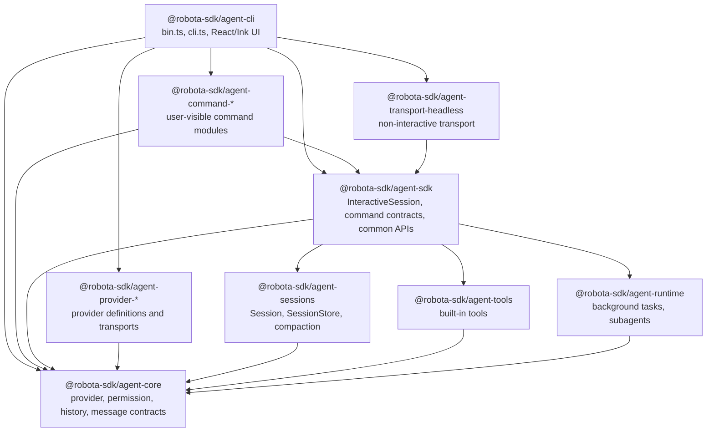
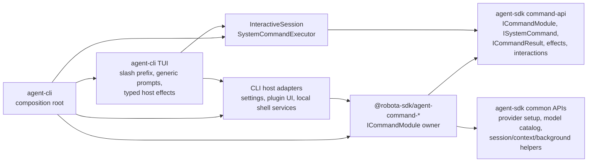
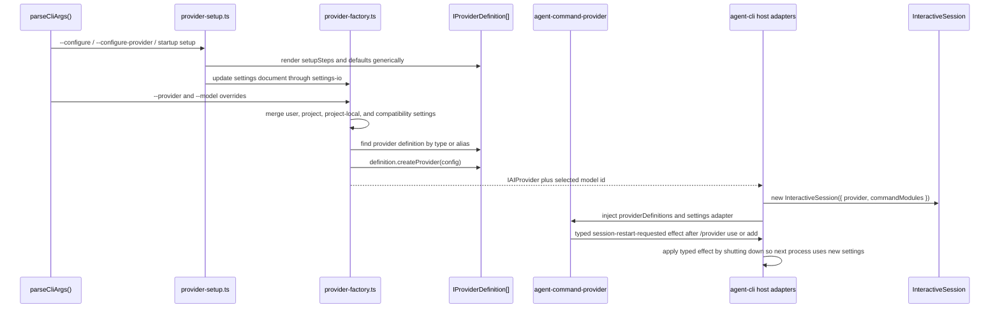
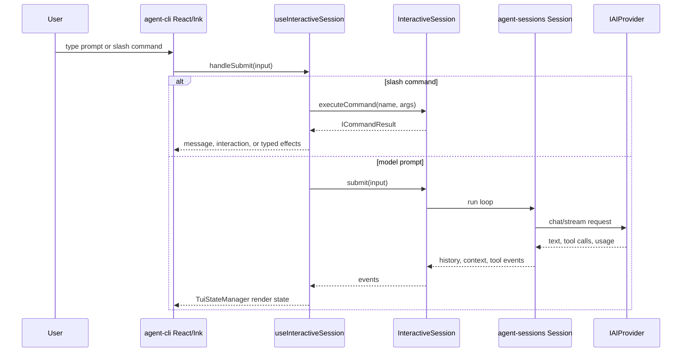
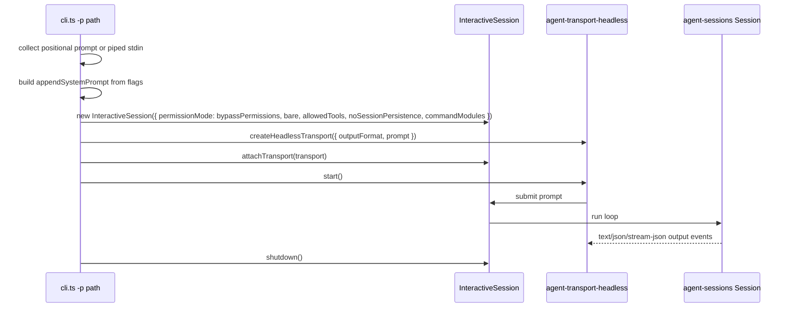

# Agent CLI Architecture Map

Source-verified against the `fix/cli-session-store-boundary` working tree on 2026-05-05.

This document is the LLM-scannable master map for how `@robota-sdk/agent-cli` is
assembled. Package `SPEC.md` files remain the source of truth for ownership
contracts; this map shows the actual composition path and records layer audit
findings that should be fixed in follow-up work.

## Reading Order

1. Start with [Package Dependency Graph](#package-dependency-graph) for allowed edges.
2. Read [CLI Composition Tree](#cli-composition-tree) for the concrete startup path.
3. Use [Built-in Command Layer](#built-in-command-layer) before changing any slash command.
4. Use [Provider and Model State Flow](#provider-and-model-state-flow) before changing setup,
   `/provider`, or `/model`.
5. Use [Layering Audit](#layering-audit) before deciding whether a concern belongs in CLI, SDK,
   a command package, provider package, runtime, sessions, or core.

## Package Dependency Graph



| Edge                                     | Status                | Rule                                                                                                                                        |
| ---------------------------------------- | --------------------- | ------------------------------------------------------------------------------------------------------------------------------------------- |
| CLI -> SDK                               | Allowed               | CLI consumes `InteractiveSession`, command registries, command contracts, SDK path helpers, and SDK-owned session persistence facade types. |
| CLI -> command packages                  | Allowed               | Product composition root selects default command modules.                                                                                   |
| CLI -> provider packages                 | Allowed               | CLI owns provider definition composition and provider instance creation.                                                                    |
| CLI -> agent-core public types           | Allowed               | CLI may use public provider, permission, history, and message types.                                                                        |
| CLI -> headless transport                | Allowed               | Print mode attaches a transport to `InteractiveSession`.                                                                                    |
| CLI -> agent-sessions                    | Forbidden by CLI SPEC | No production source or package dependency should exist; harness command layering scan enforces this edge.                                  |
| SDK -> command packages                  | Forbidden             | SDK owns contracts/common APIs and must not import command implementations. No source edge found.                                           |
| command packages -> CLI/TUI              | Forbidden             | Commands consume SDK contracts and host adapters only. No source edge found.                                                                |
| provider packages -> Robota commands/TUI | Forbidden             | Providers translate provider wire formats only. No source edge found in this audit.                                                         |

## CLI Composition Tree

```text
packages/agent-cli/src/bin.ts
`- startCli() from src/cli.ts
   |- parseCliArgs()
   |- readVersion(), update-check flags, reset/configure flags
   |- build commandHostAdapters
   |  |- settings adapter -> settings-io.ts
   |  `- plugin adapter -> plugins/plugin-command-adapter.ts
   |- providerDefinitions = DEFAULT_PROVIDER_DEFINITIONS
   |  |- agent-provider-anthropic
   |  |- agent-provider-openai
   |  |- agent-provider-gemini
   |  |- agent-provider-gemma
   |  `- agent-provider-qwen
   |- commandModules
   |  |- createHelpCommandModule()
   |  |- createAgentCommandModule()
   |  |- createModelCommandModule()
   |  |- createModeCommandModule()
   |  |- createPermissionsCommandModule()
   |  |- createLanguageCommandModule()
   |  |- createBackgroundCommandModule()
   |  |- createMemoryCommandModule()
   |  |- createCompactCommandModule()
   |  |- createContextCommandModule()
   |  |- createExitCommandModule()
   |  |- createSessionCommandModule()
   |  |- createResetCommandModule()
   |  |- createRewindCommandModule()
   |  |- createStatusLineCommandModule()
   |  |- createPluginCommandModule()
   |  |- createProviderCommandModule({ providerDefinitions, settings adapter })
   |  `- options.commandModules
   |- ensureConfig() / provider setup
   |- readProviderSettings() and createProviderFromSettings()
   |- create runtime adapters
   |  |- managed shell background runner
   |  `- child-process subagent runner factory
   |- createProjectSessionStore(cwd) from SDK for resume/persistence facade
   |- if -p print mode
   |  |- new InteractiveSession({ cwd, provider, commandModules, commandHostAdapters, ... })
   |  |- createHeadlessTransport({ outputFormat, prompt })
   |  |- session.attachTransport(transport)
   |  `- transport.start(); session.shutdown()
   `- otherwise interactive mode
      `- renderApp()
         `- App.tsx
            |- useInteractiveSession()
            |  |- new InteractiveSession({ cwd, provider, commandModules, commandHostAdapters, ... })
            |  |- CommandRegistry
            |  |- createBuiltinCommandModule()
            |  |- register injected command modules
            |  |- SkillCommandSource
            |  |- PluginCommandSource reload
            |  `- TuiStateManager event bridge
            |- useSlashRouting()
            |  |- non-slash input -> interactiveSession.submit()
            |  |- slash input -> interactiveSession.executeCommand()
            |  `- skill/plugin fallback -> executeSkillCommand()
            |- useSideEffects()
            |  |- render generic ICommandInteraction prompts
            |  `- apply typed TCommandEffect values
            `- Ink renderers
               |- MessageList
               |- InputArea
               |- SessionStatusBar / StatusBar
               |- PermissionPrompt
               |- InteractivePrompt
               |- ConfirmPrompt
               |- PluginTUI
               `- SessionPicker
```

## Built-in Command Layer

Built-in commands are product-default command modules. They are not SDK-owned
business logic and they are not CLI/TUI feature code.



| Responsibility                                                         | Owner                                                       |
| ---------------------------------------------------------------------- | ----------------------------------------------------------- |
| Slash prefix detection and unknown-command rendering                   | `agent-cli`                                                 |
| Command metadata, subcommands, lifecycle policy, interactions, effects | Owning `agent-command-*` package                            |
| Command contracts, registry, executor, effect/interactions types       | `agent-sdk`                                                 |
| Reusable command common APIs and ports                                 | `agent-sdk/src/command-api/*`                               |
| Host persistence, local process actions, UI shell actions              | `agent-cli` host adapters and TUI effect handlers           |
| Provider setup semantics for `/provider`                               | `agent-command-provider` consuming SDK provider common APIs |
| Model-change request semantics for `/model`                            | `agent-command-model` consuming SDK model common APIs       |

Forbidden shortcuts:

- A command package must not import `agent-cli` or React/Ink code.
- `agent-sdk` must not import or special-case `agent-command-*` packages.
- CLI hooks must not reimplement command-specific setup flows when a command module can own them.
- Provider packages must not know slash commands, command names, TUI behavior, or Robota workflow semantics.

## Provider and Model State Flow



Settings ownership:

- `agent-cli` owns concrete settings file paths and provider instance construction.
- `agent-command-provider` owns `/provider` command semantics and settings patches.
- `agent-sdk` owns common provider settings/setup/probe APIs used by command modules.
- Provider packages own defaults, setup metadata, validation requirements, aliases, probes, options, and `createProvider()`.

Current model catalog state:

- `/model` is supplied by `@robota-sdk/agent-command-model`.
- The command consumes SDK model command common APIs.
- On current `develop`, the model catalog is still Claude-oriented through the SDK/core Claude registry.
- Provider-aware model catalog SSOT is already tracked by `tui-provider-model-state-drift.md` and should not be solved inside this map task.

## Execution Modes

### Interactive TUI



Interactive mode currently supports:

- permission prompts through CLI React state and SDK permission handler injection;
- `/` command execution through `InteractiveSession.executeCommand()`;
- generic `ICommandInteraction` rendering;
- typed `TCommandEffect` application;
- skill and plugin command discovery through SDK command sources;
- session resume/fork/name flows through SDK-owned session persistence facade and summaries.

### Non-Interactive Print Mode



Current `develop` print mode supports `-p`, piped stdin, `--output-format`,
`--permission-mode`, `--max-turns`, `--bare`, `--allowed-tools`,
`--no-session-persistence`, `--append-system-prompt`, and `--json-schema`.

`--task-file` is not present in current `develop`; if that flag is merged from another branch,
this section must be updated in the same PR.

## Class and Interface Inventory

| Item                            | Owner                                                   | Layer                      | Inbound consumers                        | Outbound dependencies                                              | Responsibility                                                                              |
| ------------------------------- | ------------------------------------------------------- | -------------------------- | ---------------------------------------- | ------------------------------------------------------------------ | ------------------------------------------------------------------------------------------- |
| `startCli()`                    | `agent-cli/src/cli.ts`                                  | Product shell              | binary entrypoint, embedders             | SDK, command packages, providers, headless transport, settings I/O | Parse flags, compose providers/modules/adapters, choose interactive or print mode.          |
| `renderApp()`                   | `agent-cli/src/ui/render.tsx`                           | UI shell                   | `startCli()`                             | React, Ink, `App`                                                  | Start Ink app and process exit handling.                                                    |
| `App` / `AppInner`              | `agent-cli/src/ui/App.tsx`                              | UI shell                   | `renderApp()`                            | CLI hooks and components                                           | Compose TUI state, prompts, plugin UI, session picker, status bar.                          |
| `useInteractiveSession()`       | `agent-cli/src/ui/hooks/useInteractiveSession.ts`       | React-SDK bridge           | `AppInner`                               | `InteractiveSession`, `CommandRegistry`, `TuiStateManager`         | Create the SDK session once and subscribe SDK events to render state.                       |
| `useSlashRouting()`             | `agent-cli/src/ui/hooks/useSlashRouting.ts`             | UI command routing         | `useInteractiveSession()`                | `InteractiveSession`, `CommandRegistry`                            | Parse leading slash, call SDK command execution, route skill/plugin fallback.               |
| `useSideEffects()`              | `agent-cli/src/ui/hooks/useSideEffects.ts`              | UI effect application      | `AppInner`                               | CLI settings/UI adapters, `InteractiveSession`                     | Render generic interactions and apply typed command effects.                                |
| `TuiStateManager`               | `agent-cli/src/ui/tui-state-manager.ts`                 | UI state projection        | `useInteractiveSession()`                | agent-core history/context types                                   | Convert SDK events into stable render state.                                                |
| `ICommandModule`                | `agent-sdk/src/command-api/command-module.ts`           | SDK command contract       | command packages, CLI, SDK executor      | agent-sdk command API                                              | Module boundary for command sources, system commands, descriptors, requirements.            |
| `ICommandResult`                | `agent-sdk/src/command-api/command-result.ts`           | SDK command contract       | command packages, SDK, CLI               | command effects/interactions                                       | Structured command output consumed by generic hosts.                                        |
| `TCommandEffect`                | `agent-sdk/src/command-api/effects.ts`                  | SDK command contract       | command packages, CLI effect handlers    | agent-core end reason types                                        | Typed host-side work requested by commands.                                                 |
| `CommandRegistry`               | `agent-sdk/src/commands/command-registry.ts`            | SDK command infrastructure | CLI, tests                               | `ICommandSource`                                                   | Aggregate command palette entries from modules, skills, and plugins.                        |
| `BuiltinCommandSource`          | `agent-sdk/src/commands/builtin-source.ts`              | SDK command infrastructure | CLI, SDK tests                           | SDK command API                                                    | Expose SDK-default built-ins; currently empty.                                              |
| `SystemCommandExecutor`         | `agent-sdk/src/commands/system-command-executor.ts`     | SDK command infrastructure | `InteractiveSession`                     | `ISystemCommand`                                                   | Execute matching system command with SDK host context.                                      |
| `InteractiveSession`            | `agent-sdk/src/interactive/interactive-session.ts`      | SDK entrypoint             | CLI, command tests, SDK consumers        | sessions, runtime, tools, core, command API                        | Event-driven wrapper over `Session`, prompt queueing, command execution, persistence.       |
| `createProjectSessionStore()`   | `agent-sdk/src/interactive/session-persistence.ts`      | SDK facade                 | CLI, SDK consumers                       | agent-sessions, project paths                                      | Create project-local `.robota/sessions` persistence without exposing `SessionStore` to CLI. |
| `IResumableSessionSummary`      | `agent-sdk/src/interactive/session-persistence.ts`      | SDK facade type            | CLI session picker, SDK consumers        | none                                                               | Host-facing saved-session list item with id/name/cwd/update time/message count/preview.     |
| `createInteractiveSession()`    | `agent-sdk/src/interactive/interactive-session-init.ts` | SDK assembly               | `InteractiveSession`                     | config/context, plugin hooks, `createSession()`                    | Load config/context/project data and construct `Session`.                                   |
| `createSession()`               | `agent-sdk/src/assembly/create-session.ts`              | SDK assembly               | `createInteractiveSession()`, SDK tests  | sessions, tools, runtime, core                                     | Assemble provider, tools, system prompt, command tool, background/subagent runtime.         |
| `Session`                       | `agent-sessions`                                        | Session runtime            | SDK assembly                             | agent-core                                                         | Run conversation lifecycle, permissions, compaction, context tracking.                      |
| `SessionStore`                  | `agent-sessions`                                        | Session persistence        | SDK facade and generic session consumers | filesystem                                                         | Persist/resume session JSON behind `ISessionStore`. CLI must not consume it directly.       |
| `IProviderDefinition`           | `agent-core`                                            | Core/provider contract     | provider packages, CLI, provider command | core provider config types                                         | Provider defaults, setup metadata, aliases, probes, factory.                                |
| `createProviderFromSettings()`  | `agent-cli/src/utils/provider-factory.ts`               | CLI provider composition   | `startCli()`                             | provider definitions, settings I/O                                 | Resolve effective provider settings and instantiate provider.                               |
| `createProviderCommandModule()` | `agent-command-provider`                                | Command package            | CLI composition                          | SDK command and provider common APIs                               | Own `/provider` metadata, setup interactions, settings patches, restart effects.            |
| `createModelCommandModule()`    | `agent-command-model`                                   | Command package            | CLI composition                          | SDK model common API                                               | Own `/model` metadata and model-change effects.                                             |
| `createAgentCommandModule()`    | `agent-command-agent`                                   | Command package            | CLI composition                          | SDK command/runtime APIs                                           | Own `/agent` metadata and background agent command execution.                               |
| `createHeadlessTransport()`     | `agent-transport-headless`                              | Transport                  | CLI print mode                           | SDK transport contract                                             | Drive non-interactive prompt input and output formatting.                                   |

## Layering Audit

### CLI-AUDIT-001: CLI imports `agent-sessions` directly

Status: resolved in `fix/cli-session-store-boundary`.

Former files:

- `packages/agent-cli/src/cli.ts`
- `packages/agent-cli/src/ui/render.tsx`
- `packages/agent-cli/src/ui/App.tsx`
- `packages/agent-cli/src/ui/hooks/useInteractiveSession.ts`
- `packages/agent-cli/src/ui/SessionPicker.tsx`
- `packages/agent-cli/package.json`

Problem:

`packages/agent-cli/docs/SPEC.md` says CLI must not import from
`@robota-sdk/agent-sessions`, but the CLI creates and passes `SessionStore` directly.

Resolution:

Session persistence construction and the public resume/picker data contract now live behind
SDK-owned APIs in `agent-sdk/src/interactive/session-persistence.ts`. CLI calls
`createProjectSessionStore(cwd)`, `resolveLatestSessionId()`, `resolveSessionIdByIdOrName()`, and
`listResumableSessionSummaries()` from `@robota-sdk/agent-sdk`; it does not import
`@robota-sdk/agent-sessions` or declare it in `packages/agent-cli/package.json`.

Mechanical guard:

- `scripts/harness/check-command-layering.mjs` flags production CLI imports from
  `@robota-sdk/agent-sessions` and direct CLI package dependencies on it.

### CLI-AUDIT-002: TUI command effects are queued by mutating `InteractiveSession`

Status: confirmed design debt.

Current files:

- `packages/agent-cli/src/ui/hooks/useSlashRouting.ts`
- `packages/agent-cli/src/ui/hooks/useSideEffects.ts`
- `packages/agent-cli/src/ui/hooks/side-effects-types.ts`
- `packages/agent-cli/src/ui/__tests__/slash-routing-effects.test.ts`

Problem:

The TUI casts `InteractiveSession` to an `ISideEffects` intersection and stores fields such as
`_pendingCommandInteraction` and `_pendingCommandEffects` on the SDK session object. This keeps the
SDK type clean only at compile time and makes command-effect transport implicit.

Recommended fix:

Introduce an explicit CLI-owned command effect queue or an SDK-owned typed result channel. The TUI
should pass command results between hooks through owned React state or a small local controller
instead of attaching ad hoc properties to `InteractiveSession`.

Tracked follow-up:

- `.agents/backlog/cli-command-effect-state-boundary.md`

### CLI-AUDIT-003: Provider-aware model catalog is incomplete

Status: already tracked.

Current state:

- `/model` is a command module, which is the correct layer.
- The model list remains Claude-oriented through the SDK/core Claude model registry.
- Provider-specific model catalog SSOT and provider/model state consistency are tracked separately.

Tracked follow-up:

- `.agents/backlog/tui-provider-model-state-drift.md`

### CLI-AUDIT-004: Legacy assembly architecture doc was stale

Status: resolved by this documentation change.

`packages/agent-cli/docs/ASSEMBLY-ARCHITECTURE.md` described an older `createSession()`-centric CLI
assembly path and direct `FileSessionLogger` setup that no longer matches current source. It now
redirects to this master map so future readers do not treat stale architecture text as current.

### No SDK-to-command-package edge found

This audit did not find `agent-sdk` importing `@robota-sdk/agent-command-*`. That preserves the
rule that command packages consume SDK contracts like third-party modules.

### No command-package-to-CLI edge found

This audit did not find `agent-command-*` importing `agent-cli` files. That preserves command module
portability and keeps CLI/TUI as a generic host.

## Governance and Update Policy

Update this document in the same PR whenever a change affects any of these:

- `packages/agent-cli/src/cli.ts` composition of providers, command modules, transports, or runtime adapters;
- `packages/agent-cli/src/ui/hooks/useInteractiveSession.ts`, `useSlashRouting.ts`, or `useSideEffects.ts`;
- a new or removed `@robota-sdk/agent-command-*` module in the default CLI product;
- provider setup, provider switching, model catalog, or model switching flow;
- interactive vs non-interactive execution mode flags or transport behavior;
- package dependencies among CLI, SDK, command packages, provider packages, runtime, sessions, tools, or core.

Before merging a CLI architecture change:

- Check this map against the source imports and composition code.
- Check the owning package `SPEC.md` files for boundary drift.
- Add a follow-up backlog when a discovered violation is larger than the current change.
- Prefer a mechanical harness scan when a repeated architecture invariant can be detected with good signal.

Suggested mechanical checks from this audit:

- Scan `packages/agent-cli/src` for forbidden imports from `@robota-sdk/agent-sessions` and
  `@robota-sdk/agent-tools`; the `agent-sessions` import/dependency edge is now enforced.
- Scan `packages/agent-sdk/src` for imports from `@robota-sdk/agent-command-*`.
- Scan `packages/agent-command-*/src` for imports from `packages/agent-cli` or
  `@robota-sdk/agent-cli`.
