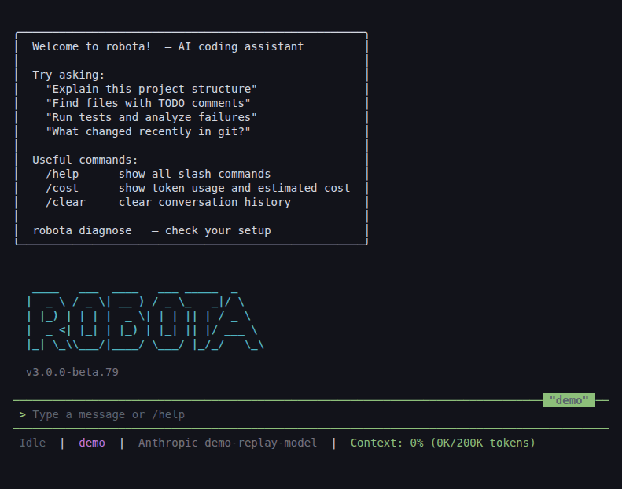

**Language:** [English](../README.md) | [한국어](README-KO.md)

# @robota-sdk/agent-cli

`robota`는 터미널에서 쓰는 AI 코딩 어시스턴트이자, AI 에이전트를 만드는 TypeScript 라이브러리
모음인 Robota의 레퍼런스 앱입니다. 프로젝트를 읽고, 사용자가 통제하는 권한 체계 아래에서 파일을
수정하고 명령을 실행하며, Anthropic, OpenAI, Gemini, DeepSeek, Qwen과 로컬 OpenAI 호환 모델을
지원합니다.

이 CLI는 여러분의 앱에서도 쓸 수 있는 같은 패키지들로 조립되어 있습니다. 세션은
`@robota-sdk/agent-framework`, 터미널 UI는 `@robota-sdk/agent-ui-terminal`이 맡고, 모델 제공자마다
패키지가 하나씩 있습니다. 이 에이전트를 쓰는 대신 직접 에이전트를 만들려면
[SDK 가이드](../../../content/guide/sdk.md)부터 보세요.

> **베타.** 정식 릴리스 전까지 동작이 바뀔 수 있습니다.
> [이슈를 알려 주세요](https://github.com/woojubb/robota/issues).



## 설치

Node.js 22.12.0 이상이 필요합니다.

```bash
npm install -g @robota-sdk/agent-cli   # `robota` 명령을 설치합니다
npx @robota-sdk/agent-cli              # 설치하지 않고 한 번 실행합니다
```

macOS의 Terminal.app에서는 한국어 등 CJK 입력기가 충돌을 일으킬 수 있습니다.
[iTerm2](https://iterm2.com/) 같은 다른 터미널을 쓰세요.

## 첫 실행

Git 저장소 안에서 `robota`를 실행합니다. 먼저 이 폴더를 신뢰할지 묻습니다. 프로젝트 자체의 설정,
훅, 스킬, 플러그인, MCP 서버는 신뢰한 워크스페이스에서만 불러옵니다. 신뢰하지 않으면 세션은
**Restricted** 상태로 시작하며, 사용자 설정과 기본 도구만 씁니다. 처음 실행할 때는 이어서 제공자를
고르고 그 항목(모델, 기본 URL, API 키)을 채우는 과정을 안내한 뒤, 프로필을 `~/.robota/settings.json`에
저장합니다.

```bash
cd my-project
robota
```

서버처럼 입력 프롬프트 없이 설정하려면, 플래그로 프로필을 만들고 워크스페이스를 신뢰합니다.
프로필에는 키 자체가 아니라 환경 변수에 대한 참조가 저장되며, 명령을 실행할 때 그 변수가 설정되어
있어야 합니다.

```bash
export ANTHROPIC_API_KEY=sk-ant-...
robota --configure-provider anthropic --type anthropic --model claude-sonnet-4-6 \
  --api-key-env ANTHROPIC_API_KEY --set-current
robota trust --yes
```

`robota init`은 현재 프로젝트에 기본 `AGENTS.md`와 `.robota/settings.json`을 만듭니다.
`robota --configure`는 대화형 제공자 설정을 다시 실행하고, `robota --reset`은
`~/.robota/settings.json`을 삭제합니다.

## 할 수 있는 일

### 터미널 UI에서 작업하기

`robota`는 대화형 세션을 시작합니다. 요청을 입력하거나 `/`를 눌러 명령 메뉴를 엽니다(`/help`는 모든
명령을 보여 줍니다). `Esc`는 진행 중인 응답을 멈추고, `Ctrl+R`은 이전에 입력한 프롬프트를 검색하며,
모든 키는 `~/.robota/keybindings.json`에서 다시 지정할 수 있습니다
([키 바인딩 가이드](../../../content/guide/keybindings.md) 참고).

에이전트는 파일·셸 도구(`Read`, `Write`, `Edit`, `Glob`, `Grep`, `Bash`), `WebFetch`,
`WebSearch`(`BRAVE_API_KEY` 필요), `AskUserQuestion`을 쓰며, 서브에이전트와 백그라운드 작업에 일을 넘길
수 있습니다. 신뢰한 워크스페이스에서는 프로젝트의 `AGENTS.md`와 `CLAUDE.md`를 컨텍스트로 불러오고,
프롬프트에 `@path`를 쓰면 프로젝트 파일을 첨부합니다.

```bash
robota                              # 새 세션
robota --permission-mode acceptEdits
robota --screen-reader              # 스크린 리더용 일반 텍스트 모드
```

### 스크립트에서 프롬프트 하나 실행하기

프린트 모드(`-p`)는 터미널 UI 없이 프롬프트 하나를 실행하고 종료합니다. 프롬프트 인자가 없으면
파이프로 들어온 stdin에서 프롬프트를 읽습니다.

```bash
robota -p "List the TypeScript files in src/"
robota -p "Summarize this repository" --output-format json   # JSON 객체 하나: result, session_id
cat task.md | robota -p                                      # stdin에서 프롬프트 읽기
robota -p "Review this diff" --bare                          # 파이프라인용 원문 텍스트
robota --goal "make the failing tests pass"                  # 여러 턴에 걸쳐 목표를 향해 작업
```

`--output-format`은 `text`(기본값), `json`, `stream-json` 중 하나입니다. `--json-schema`는 스키마에
맞는 JSON 응답을 요청하고, `--system-prompt` / `--append-system-prompt`는 이번 실행의 시스템
프롬프트를 바꿉니다. 종료 코드는 성공이면 `0`, 오류면 `1`입니다. 사용할 수 있는 제공자 설정이
없으면 `-p`는 `3`으로 끝나고, 목표에 도달하지 못하고 멈춘 `--goal` 실행은 `2`로 끝납니다. 신뢰하지
않은 Git 저장소에서는 프린트 모드, `--goal`, `--serve`, `robota mcp serve`, `robota daemon start`,
`robota session start`가 시작을 거부합니다. 앞의 네 가지는 `--safe-mode`를 붙이면 대신 Restricted
상태로 실행되고, `robota daemon start --restricted-workspace`는 데몬을 Restricted로 시작합니다.

### 세션 이어 가기, 백그라운드 실행, 데몬 공유

세션은 저장되므로 나중에 다시 돌아올 수 있습니다.

```bash
robota -c                           # 가장 최근 세션 이어 가기
robota -r <id-or-name>              # 세션 재개
robota -r <id> --fork-session       # 원본은 그대로 두고 복사본으로 이어 가기
robota -n "refactor auth"           # 새 세션에 이름 붙이기
```

세션 안에서는 `/resume`으로 세션을 바꾸고, `/rename`으로 현재 세션 이름을 정하고, `/fork`로 대화를
백그라운드 세션에 복사하고, `/cd <directory>`로 대화를 다른 디렉터리로 옮깁니다.

감독(supervised) 세션은 터미널을 닫아도 계속 실행되고, 워크스페이스 데몬은 터미널과 데스크톱 앱이
함께 쓰는 오래 사는 런타임 하나입니다. 아직 신뢰하지 않은 폴더에서는 데스크톱 앱이 데몬을 시작하기 전에
창에서 신뢰할지, Restricted로 시작할지, 종료할지 묻습니다.

```bash
robota session start --background --name nightly
robota session list
robota session attach <supervised-id>          # --observe를 붙이면 읽기 전용으로 지켜봅니다
robota daemon start                            # 그다음: robota --attach
robota daemon stop
```

[세션과 데몬](../../../content/guide/sessions-and-daemon.md)을 참고하세요.

### 에이전트가 할 수 있는 일 통제하기

모든 도구 호출은 deny 규칙, ask 규칙, allow 규칙을 거친 뒤 권한 모드로 결정됩니다.

| 모드                | 읽기 | 파일 수정 | 셸 명령                               |
| ------------------- | ---- | --------- | ------------------------------------- |
| `plan`              | 허용 | 거부      | 거부(기본 제공 읽기 전용 명령은 예외) |
| `default`           | 허용 | 물어봄    | 물어봄                                |
| `acceptEdits`       | 허용 | 허용      | 물어봄                                |
| `auto`              | 허용 | 허용      | 모델 분류기가 결정                    |
| `bypassPermissions` | 허용 | 허용      | 허용                                  |

모드는 `--permission-mode <mode>`로 정하거나(`--dry-run`은 `plan`과 같습니다) 세션 안에서
`/permissions <mode>`로 바꿉니다. `/permissions`만 입력하면 적용 중인 규칙과 최근 거부 내역을 보여
줍니다. 규칙은 어느 설정 파일에나 둘 수 있습니다.

```json
{
  "permissions": {
    "allow": ["Bash(pnpm *)", "Bash(git status)"],
    "ask": ["Bash(git push *)"],
    "deny": ["Bash(rm -rf *)", "Write(.env)"]
  }
}
```

`ask` 규칙은 `bypassPermissions`에서도 물어보며, 몇 가지 동작은 어떤 모드에서도 자동 승인되지
않습니다. 루트·홈·작업 디렉터리에 대한 `rm`, 그리고 `.git`, `.robota`, `.claude`, `.agents`나 셸·도구
설정 파일에 쓰는 동작이 그렇습니다.

셸 명령은 OS 샌드박스(Linux는 bubblewrap, macOS는 Seatbelt) 안에서 실행할 수도 있습니다.
`/sandbox`는 `auto-allow`, `regular`, `off` 사이를 전환하고, `sandbox` 설정 키로 구성합니다. 뭔가
이상하게 동작하면 `robota --safe-mode`로 지시 파일, 스킬, 플러그인, 훅, MCP 서버를 모두 끈 채
시작해 보세요.

워크스페이스 신뢰는 Git 워크트리 단위로 부여되며 `~/.robota/workspace-trust.json`에 저장됩니다.

```bash
robota trust status    # 이 워크스페이스를 신뢰하는가? 신뢰하면 무엇을 불러오는가? (--json: 한 줄 JSON)
robota trust --yes     # 지금 있는 Git 워크스페이스를 신뢰
robota trust revoke --yes
```

[권한과 훅](../../../content/guide/permissions-and-hooks.md)을 참고하세요.

### 제공자와 모델 고르기

`providers`의 각 제공자 프로필은 `type`(`anthropic`, `openai`, `gemini`, `deepseek`, `qwen`,
`gemma`)과 모델, 그리고 선택적으로 기본 URL과 API 키를 지정하며, `currentProvider`가 사용할 프로필을
고릅니다. 설정 과정은 키를 환경 변수 참조로 채워 넣습니다.

| 제공자 타입 | 기본 키 변수        | 비고                                                               |
| ----------- | ------------------- | ------------------------------------------------------------------ |
| `anthropic` | `ANTHROPIC_API_KEY` |                                                                    |
| `openai`    | `OPENAI_API_KEY`    | `baseURL`로 다른 OpenAI 호환 엔드포인트도 사용                     |
| `gemini`    | `GEMINI_API_KEY`    |                                                                    |
| `deepseek`  | `DEEPSEEK_API_KEY`  |                                                                    |
| `qwen`      | `DASHSCOPE_API_KEY` | Alibaba Cloud Model Studio                                         |
| `gemma`     | 없음                | 로컬 Gemma 모델. 기본 URL은 LM Studio의 `http://localhost:1234/v1` |

```json
{
  "currentProvider": "claude",
  "providers": {
    "claude": {
      "type": "anthropic",
      "model": "claude-sonnet-4-6",
      "apiKey": "$ENV:ANTHROPIC_API_KEY"
    }
  }
}
```

세션 안에서는 `/provider list`, `/provider switch <profile>`, `/provider add`, `/provider test`로
프로필을 관리합니다. 한 번의 실행에 대해서는 `--provider <profile>`로 프로필을 고르고(`--set-current`를
붙이면 기본값이 됩니다), `--model`로 모델을 덮어쓰고, `--fallback-model a,b`로 첫 모델이 과부하일 때
다른 모델에서 턴을 이어 가고, `--effort <level>`로 모델 effort를 정하고, `--advisor <profile[:model]>`로
모델이 두 번째 모델에게 조언을 구하게 할 수 있습니다. [제공자](../../../content/guide/providers.md)와
[로컬 LLM 설정](../../../content/guide/local-llm.md)을 참고하세요.

### MCP 서버 연결하기, 또는 Robota를 MCP로 제공하기

원격 MCP 서버는 설정 파일의 `mcpServers` 아래에 선언합니다. 선언한 서버는 승인하기 전까지 연결되지
않습니다. `/mcp`는 각 서버의 상태를 보여 주고, `/mcp approve <server>`는 승인을 기록합니다. `robota`
실행 파일은 승인을 메모리에만 두므로 다음 실행에는 이어지지 않습니다. OAuth를 쓰는 서버는 로그인도
필요합니다. 세션 안에서는 `/mcp login <server>`, 터미널에서는 `robota mcp login <server>`를 쓰며,
승인된 서버는 로그인하면 실행 중인 세션에 연결됩니다.

```json
{
  "mcpServers": {
    "docs": { "type": "http", "url": "https://mcp.example.com/mcp", "oauth": {} }
  }
}
```

`robota mcp serve`는 그 반대입니다. Robota 세션 하나를 stdio로(또는 `--http-*`, `--oauth-*` 플래그로
인증된 HTTP로) MCP 호스트에 제공합니다. 먼저 프로젝트를 신뢰하고, 호스트에는 `robota`의 절대 경로와
프로젝트 디렉터리를 알려 줍니다.

```json
{
  "mcpServers": {
    "robota": {
      "command": "/absolute/path/to/robota",
      "args": ["mcp", "serve"],
      "cwd": "/absolute/path/to/trusted/project"
    }
  }
}
```

[MCP](../../../content/guide/mcp.md)를 참고하세요.

### 스킬, 명령, 에이전트, 플러그인 추가하기

스킬과 명령은 CLI가 `.robota/skills/`, `.claude/skills/`, `.claude/commands/`, `.agents/skills/`에서
찾는 Markdown 파일입니다. 신뢰한 프로젝트와 홈 디렉터리 양쪽에서 찾습니다. 각각이 슬래시 명령
(`/<name>`)이 되고, `/skills`가 목록을 보여 줍니다. 에이전트 정의는 `.robota/agents/`,
`.agents/agents/`, `.claude/agents/`에서 읽습니다. 플러그인은 이것들을 훅, 테마, MCP 서버와 함께
묶습니다.

```text
/plugin marketplace add <source>
/plugin install <name>@<marketplace>
/plugin                              # 플러그인 관리자 열기
```

스킬 frontmatter와 플러그인 관리는 [CLI 가이드](../../../content/guide/cli.md)를 참고하세요.

### 그래픽 인터페이스 쓰기

`robota --serve --open`은 현재 워크스페이스용 헤드리스 런타임을 시작하고, Robota GUI를
`127.0.0.1`에서 제공하며, 브라우저에서 엽니다. 이 저장소의 Electron 데스크톱 앱
([`apps/agent-app`](../../../apps/agent-app/docs/README.md))은 워크스페이스 데몬 위에서 같은 GUI를
보여 주며, npm에는 배포되지 않습니다.

### 다른 세션과 다른 기기에 닿기

`/peers`는 이 컴퓨터에서 실행 중인 다른 `robota` 세션을 보여 주고, `/peers send <session-id>
<message>`는 그중 하나에 메시지를 보냅니다. 받는 세션은 그 메시지를 자기 작업과 똑같이 자신의 권한
아래에서 처리합니다. `/handoff <session-id>`는 양쪽이 확인하면 이 대화를 다른 세션으로 옮깁니다.
다른 기기에도 닿으려면 `/devices init`으로 기기 ID를 만들고, 새 기기를 `/devices add`와
`/devices join`으로 연결한 뒤, 사용자 설정에서 `transports.mesh.enabled`를 `true`로 설정합니다.
`/remote-control enable`은 브라우저를 페어링해 현재 세션을 함께 조작하게 합니다.

[기기와 원격 제어](../../../content/guide/devices-and-remote.md)를 참고하세요.

### 설정과 사용량 확인하기

```bash
robota doctor            # 설정 계층, 제공자, 신뢰, 저장소, 플러그인, 훅, MCP
robota usage             # 최근 7일의 세션, 턴, 토큰, 비용 (--period 30d)
robota --check-update    # npm에 새 버전이 있는가?
robota eval <definition> # evals-as-code 정의 실행. 지표 위반 시 1로 종료
```

## 설정 파일

설정은 다음 파일들을 우선순위가 낮은 것부터 병합합니다. 사용자 파일 두 개는 항상 적용되고, 프로젝트
파일 네 개는 신뢰한 워크스페이스에서만 적용됩니다.

| 파일                          | 범위                              |
| ----------------------------- | --------------------------------- |
| `~/.robota/settings.json`     | 사용자                            |
| `~/.claude/settings.json`     | 사용자 (Claude Code 호환)         |
| `.robota/settings.json`       | 프로젝트, 저장소에 커밋           |
| `.robota/settings.local.json` | 프로젝트, 이 컴퓨터 전용          |
| `.claude/settings.json`       | 프로젝트 (Claude Code 호환)       |
| `.claude/settings.local.json` | 프로젝트, 로컬 (Claude Code 호환) |

CLI가 `~/.robota/` 아래에 두는 그 밖의 파일:

| 경로                   | 내용                                                               |
| ---------------------- | ------------------------------------------------------------------ |
| `workspace-trust.json` | 신뢰한 워크스페이스                                                |
| `sessions/`            | 저장된 세션 (신뢰한 프로젝트는 `.robota/sessions/`에 둘 수도 있음) |
| `history.jsonl`        | `Ctrl+R`용으로 입력한 프롬프트 (`"promptHistory": false`로 끔)     |
| `keybindings.json`     | 키 바인딩                                                          |
| `themes/`              | 직접 만든 `/theme` 테마                                            |
| `plugins/`             | 설치한 플러그인 (프로젝트는 자체 `.robota/plugins/`를 둘 수 있음)  |
| `mcp-credentials/`     | MCP 서버용 OAuth 토큰, 본인만 읽을 수 있음                         |

## 코드에서 쓰기

이 패키지는 `robota` 실행 파일이 실행하는 함수인 `startCli`와 그 옵션 타입 `IStartCliOptions`도
export합니다. 패키지는 ESM 전용이므로 `require()`가 아니라 `import`로 불러오세요.

## 이 저장소에서 CLI 개발하기

```bash
pnpm install && pnpm build
pnpm cli:dev          # 소스에서 CLI 실행
pnpm cli:trust        # 소스 CLI가 이 저장소를 신뢰하도록 설정
```

## 문서

- [CLI 가이드](../../../content/guide/cli.md) — 모든 명령, 플래그, 설정
- [세션과 데몬](../../../content/guide/sessions-and-daemon.md)
- [권한과 훅](../../../content/guide/permissions-and-hooks.md)
- [제공자](../../../content/guide/providers.md)와 [로컬 LLM 설정](../../../content/guide/local-llm.md)
- [MCP](../../../content/guide/mcp.md)
- [기기와 원격 제어](../../../content/guide/devices-and-remote.md)
- [SPEC.md](./SPEC.md) — 이 패키지가 맡는 것과 보장하는 것

## 라이선스

Robota는 [GNU AGPL-3.0](../../../LICENSE) 또는 [상용 라이선스](../../../COMMERCIAL.md)로 이중
라이선스됩니다. [LICENSING.md](../../../LICENSING.md)를 참고하세요.
