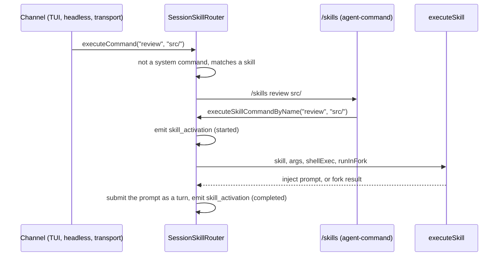

# agent-cli — command and skill execution pipeline

> Whitebox design for `@robota-sdk/agent-cli`. The blackbox contract lives in
> [`../SPEC.md`](../SPEC.md); nothing here is a promise to a consumer.

## Context & Goal

How a slash command, and a skill in particular, travels from an input line to a prompt the model
runs. Almost none of this pipeline is CLI code: the presentation channel forwards the input,
`InteractiveSession` in `@robota-sdk/agent-framework` routes it, the `/skills` command module in
`@robota-sdk/agent-command` activates the skill, and the framework's `executeSkill()` builds the
prompt. The CLI supplies the inputs that make it robota's: the skill roots, the model command-tool
prefix, and the shell function used for skill preprocessing.

## Constraints

- Every surface calls `session.executeCommand()` and nothing else. The TUI channel
  (`TuiInteractionChannel` in `@robota-sdk/agent-ui-terminal`), the headless `stream-json` input,
  and the transport session-message handler (remote clients) all go through it. No surface builds
  skill activation state or calls a skill-specific SDK method.
- A skill counts as used only when the session emits a `skill_activation` event. An assistant
  message claiming it used a skill is not an activation.
- Skill shell preprocessing runs through the host-supplied `shellExec`. It does not pass through the
  tool permission prompt. Skills from the project are loaded only when the workspace is trusted, so a
  project cannot run `` !`cmd` `` lines until the user trusts it.

## Internal Structure

### What the CLI supplies

| Input                     | Where it comes from                                                           | Used for                                                                         |
| ------------------------- | ----------------------------------------------------------------------------- | -------------------------------------------------------------------------------- |
| Skill roots               | `ROBOTA_SKILL_ROOTS` in `src/product/robota-skill-roots.ts`                   | Where `SkillCommandSource` looks for skill folders and command files             |
| Contribution sources      | `createCliWorkspaceComposition()`                                             | Project sources only when the workspace is trusted, plus user sources            |
| Model command-tool prefix | `ROBOTA_MODEL_COMMAND_TOOL_PREFIX` (`robota_command_`) in `robota-profile.ts` | Names the tools that expose model-invocable commands                             |
| `shellExec`               | `runShellCommand()` in `src/startup/shell-exec.ts`                            | Runs `` !`cmd` `` lines in skill bodies (synchronous, 5 s timeout, piped output) |

### Routing inside the session

`SessionSkillRouter` (agent-framework) holds a `SystemCommandExecutor` built from the command
modules' system commands and a `SkillCommandSource` over the skill roots. When `executeCommand`
receives a name that is not a system command but matches a skill, it rewrites the call to the
command whose semantic role is `skillActivation` — the `/skills` command from
`@robota-sdk/agent-command` — as `/skills <skill-name> [args]`.

`/skills` calls back into the session with `executeSkillCommandByName()`. For a user invocation the
router refuses skills marked not user-invocable; for a model invocation it refuses skills with
`disable-model-invocation`. It then emits `skill_activation` (`started`, then `completed` or
`failed`) and calls `executeSkill()`.

### Building the prompt

`executeSkill()` in `packages/agent-framework/src/commands/skill-executor.ts`:

1. Runs every `` !`cmd` `` in the skill body through `shellExec` and replaces it with the output (an
   empty string when the command fails or no `shellExec` was supplied).
2. Substitutes the argument and session variables (`$ARGUMENTS`, `$ARGUMENTS[N]`, `$N`,
   `${CLAUDE_SESSION_ID}`).
3. For a normal skill, wraps the result in a `<skill name="…">` block and returns it as a prompt.
   For a skill with `context: fork`, runs the result in a subagent session and returns the
   subagent's answer instead.

A user invocation submits the prompt as a new turn. A model invocation does not start a turn: the
activation result, including the built prompt, goes back to the model as the tool result.

### Model-invoked skills

`/skills` is model-invocable, so the session projects it as the tool `robota_command_skills`. The
model passes the skill name and its arguments in `args`. The system prompt lists skill names and
descriptions only; a skill's body is loaded when `/skills` activates it.

## Key Flows

How a user invokes a skill is contract; see [`../SPEC.md`](../SPEC.md).

## Test Approach

`packages/agent-framework/src/commands/__tests__/` covers the registry, skill sources and
`executeSkill`; `packages/agent-framework/src/__tests__/skill-prompt.test.ts` covers substitution and
shell preprocessing; `packages/agent-cli/src/__tests__/headless-skill-activation.integration.test.ts`
runs activation end to end through the CLI's headless path.
