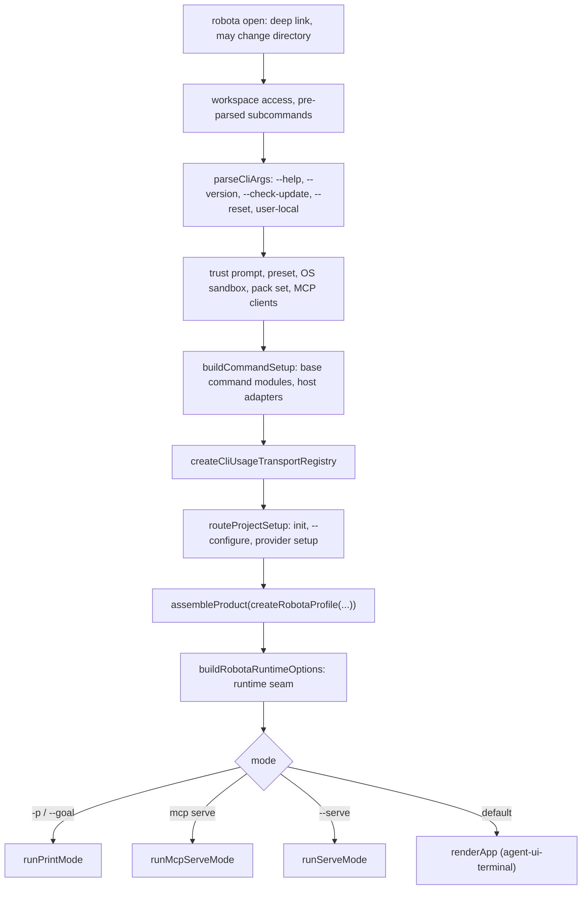

# agent-cli — composition and transport registry

> Whitebox design for `@robota-sdk/agent-cli`. The blackbox contract lives in
> [`../SPEC.md`](../SPEC.md); nothing here is a promise to a consumer.

## Context & Goal

How one `robota` run turns resolved settings into an assembled product, binds it to a mode, and
registers transports. The user sees only the resulting behaviour; which function builds what, and in
which order, is internal.

The shell is `startCliCore()` in `src/cli-core.ts`. It reads arguments, settings and the environment,
then calls the product-neutral `assembleProduct()` from `@robota-sdk/agent-product` once, with robota's
identity declared as data in `createRobotaProfile()` (`src/product/robota-profile.ts`).

## Constraints

- `assembleProduct()` never branches on a product, provider or transport name. Everything that makes
  the product robota is data in the profile.
- The shell resolves the preset once (`resolveShellPreset()` in `src/startup/preset-selection.ts`) and
  hands that registry to the profile; `assembleProduct()` adopts it instead of building a second one.
- Concrete transports are chosen by the shell, never by the assembler.
- The headless entry never imports the terminal UI. `startCliCore()` takes the presentation as an
  optional `ICliPresentation` value, and only `startCli()` in `src/cli.ts` supplies it.

## Internal Structure

### Entry points

| Entry                 | What it does                                                             | Used by                                  |
| --------------------- | ------------------------------------------------------------------------ | ---------------------------------------- |
| `src/bin.ts`          | `startCli()` → `startCliCore(options, runners, presentation)`            | The `robota` binary                      |
| `src/headless-bin.ts` | `startCliCore({}, runners)` with no presentation; accepts only `--serve` | The desktop app's headless runtime build |
| `src/index.ts`        | Exports `startCli` and `IStartCliOptions`                                | Code that embeds the CLI                 |

Both binaries first check for the subagent worker flag and, when present, run
`runSubagentWorkerMain(createRobotaSubagentComposition())` instead of the CLI (see
[`subagent-wiring.md`](subagent-wiring.md)).

### Startup order

Pre-parsed subcommands (`doctor`, `trust`, `daemon`, `session …`, `usage`, `mcp login|logout`,
`eval`) are routed by `runPreparsedCliCommand()` in `src/startup/preparsed-command-routing.ts` and
return before the product is assembled. See [`internal-structure.md`](internal-structure.md).

### Command modules

Built-in commands are `ICommandModule` instances injected into the session. A command module owns its
metadata and returns structured results; the session executes any host actions a result carries
through `ICommandHostAdapters`.

1. `buildCommandSetup()` (`src/startup/command-setup.ts`) calls `createDefaultCommandModules()` from
   `@robota-sdk/agent-command`, with the names the packs supply disabled.
2. `createRobotaPackSet()` (`src/product/robota-subagent-composition.ts`) builds the packs from
   `createRobotaPacks()`. Robota composes one pack, `createCodingPack()` from
   `@robota-sdk/pack-coding`, which supplies the `/shell`, `/editor` and `/git` modules, the coding tools and the coding subagents.
   Dropping the pack from the profile drops all of them.
3. `assembleProduct()` merges base and pack modules additively. A colliding id is rejected, not
   overridden, and the shell reports it (`Capability … was not composed`).
4. `selectProductCommandModules()` (`src/product/robota-plumbing.ts`) applies the preset's
   `enabledCommandModules` / `disabledCommandModules` to that merged set, then appends the fixed
   modules the preset never filters: `/workflows` from `@robota-sdk/agent-command-workflows` and any
   `commandModules` a caller passed to `startCli()`.

Preset module names that match nothing are reported by `reportUnknownPresetModules()` before
`init` and `--configure` can return early.

### Tool surface

The packs own robota's tools. `buildRobotaRuntimeOptions()` passes `ROBOTA_PACKS_OWN_TOOL_SURFACE`
(an empty list) as the session's `defaultTools`, which replaces agent-framework's own default tool
tier; the kernel then adds each pack's tools to `additionalTools`. The pack file tools are scoped to
the `cwd` they are built with, so the shell builds the packs before command setup. MCP tools and the
advisor tool are appended to `additionalTools` afterwards.

### Runners and the subagent factory

The shell builds the background-task runners (`createDefaultBackgroundTaskRunners()` from
`@robota-sdk/agent-executor`) and the subagent runner factory (`createRobotaSubagentRunnerFactory()`),
passes them into the profile, and reads them back from the assembled product with
`bindAssembledCollaborators()`. Every mode receives the instances the product holds.

### Transport registry

`createCliUsageTransportRegistry()` (`src/usage/usage-transport-registry.ts`) wraps
`createDefaultTransportRegistry()` in `src/product/robota-plumbing.ts`. That function creates:

- a `TransportRegistry` — the class belongs to `@robota-sdk/agent-framework` — whose saved
  enable/option state lives in the `transports` section of the user settings file;
- a `WsTransport` from `@robota-sdk/agent-transport-ws`, which takes an optional launch token and
  port from `ROBOTA_WS_TOKEN` / `ROBOTA_WS_PORT` and removes the token from the environment;
- `bindTransports(session)`, which binds the WebSocket transport to a session with
  `bindTransportAdapter()` and registers it, or replaces the earlier binding after a session switch.

| Transport                    | Registered by                                                   | Started by                                    |
| ---------------------------- | --------------------------------------------------------------- | --------------------------------------------- |
| `WsTransport` (`ws`)         | `bindTransports()` when a session binds                         | `startAll()`; enabled by default              |
| `WebRtcTransport` (`webrtc`) | the remote-control controller when `/remote-control` is enabled | the controller itself; not enabled by default |

Each mode receives the registry:

- **TUI** — `renderApp()` passes it to every `TuiInteractionChannel`, which calls `bindTransports`
  and then `startAll()` when it starts, and `stopAll()` when it stops.
- **`--serve`** — `runServeMode()` hands it and `bindTransports` to `startRuntimeHost()` from
  agent-framework.
- **Print mode** — no transports.

The CLI does not own WebSocket protocol framing. With `--serve --open` it serves the GUI web app
(built from `packages/agent-gui-web` and copied into `dist/web`) on a separate localhost server and
points it at the WebSocket port; the transport itself serves no UI.

### Exit and other host actions

`/exit` comes from `@robota-sdk/agent-command`. Its result carries a `session-exit` host action; the
session runs it through `commandHostAdapters.process.requestExit()`. In TUI mode the shell installs
`createTuiProcessAdapter()` (`src/startup/host-action-adapters.ts`), which sends the process a
`SIGTERM` shortly afterwards so the TUI shuts down through its normal signal path.

`/plugin` and `/reload-plugins` also come from agent-command. The CLI supplies only the
`ICommandPluginAdapter` implementation (`src/plugins/default-plugin-command-adapter.ts`) and the
plugin command-source loader; the terminal UI opens the plugin screen and reloads the registry.

## Key Flows

Settings → base command modules → `assembleProduct(createRobotaProfile(…))` → preset delta → runtime
options → mode → session construction → transport binding. What the user can observe of this chain
is specified in [`../SPEC.md`](../SPEC.md).

## Test Approach

`src/__tests__/robota-assembly-equivalence.test.ts`, `robota-runtime-seam.test.ts` and
`cli-command-composition.test.ts` cover the fold, the runtime seam and the module selection;
`src/product/__tests__/assembled-collaborators.test.ts` covers the collaborator identity.
