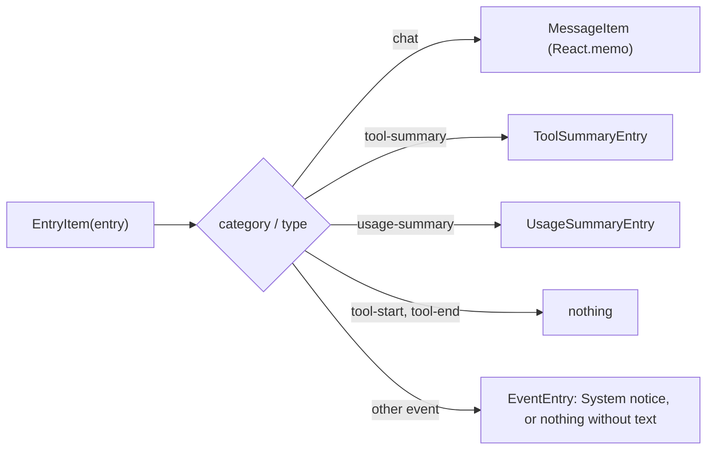

# agent-cli — message model in the terminal UI

> Whitebox design for `@robota-sdk/agent-cli`. The blackbox contract lives in
> [`../SPEC.md`](../SPEC.md); nothing here is a promise to a consumer.

## Context & Goal

Which type the transcript holds, where it is kept, and how each entry is rendered. The code lives in
`@robota-sdk/agent-ui-terminal` (render state and components) and `@robota-sdk/agent-framework`
(the session history); the CLI defines no message types of its own. The user sees rendered output;
the types behind it are not contract.

## Constraints

- `IHistoryEntry` is owned by `@robota-sdk/agent-core`. Neither the CLI nor the terminal UI
  redefines it, and there is no local `IChatMessage`.
- The session is the source of truth. The UI replaces its copy with `session.getFullHistory()` and
  never edits session entries.
- Event text is built by neutral packages from parts that may be untrusted (a plugin's skill name, a
  memory topic), so the render site sanitizes it with `sanitizeTerminalText()` before printing.

## Internal Structure

### Types

`IHistoryEntry` has an `id`, a `timestamp`, a `category`, a `type` and type-specific `data`.

- `category: 'chat'` entries carry a `TUniversalMessage` in `data`; `messageToHistoryEntry()` sets
  `type` to the message role.
- Every other entry is an event (`category: 'event'`), for example `tool-summary`, `usage-summary`
  or `skill-activation`.

`TUniversalMessage` is still used where a message is needed on its own: provider calls
(`getMessagesForAPI()` filters chat entries back into messages) and the type guards
`isToolMessage()` and `isAssistantMessage()`.

### Where the transcript is kept

`TuiStateManager` (`packages/agent-ui-terminal/src/tui-state-manager.ts`) holds
`history: IHistoryEntry[]` for one `TuiInteractionChannel`. `TuiSessionEventProjector` updates it from
session events:

| Event                                                              | Effect on `history`                                                                |
| ------------------------------------------------------------------ | ---------------------------------------------------------------------------------- |
| `complete`, `error`, `compact`, `skill_activation`, `memory_event` | Replaced with `session.getFullHistory()`                                           |
| `user_message`                                                     | The prompt is echoed at once; the session's own entry replaces it on the next sync |
| `history_cleared`                                                  | Emptied                                                                            |

The replace is whole: there is no windowing, so the render tree holds the full session history.
Notices the terminal adds itself (`addEntry()`, for example "Unknown command") are system chat
messages built with `messageToHistoryEntry(createSystemMessage(…))`; they keep their position across
later syncs.

When the user aborts a turn, the framework appends the partial answer and an "Interrupted by user."
notice to the session history. When a turn fails mid-stream, it keeps the partial answer as an
assistant message with `state: 'interrupted'`, which `MessageItem` renders with an "(interrupted)"
marker.

### Rendering

The transcript is printed with Ink's `<Static>` in `AppPresentation.tsx`: the banner first, then one
`EntryItem` per history entry, keyed by `entry.id`. `<Static>` prints each item once, so only the
newly appended tail reaches the terminal.

- `MessageItem` renders user, assistant, system and tool messages; tool messages are narrowed with
  `isToolMessage()` before `name` is read. `React.memo` skips re-rendering unchanged messages.
- `tool-start` and `tool-end` entries are kept for persistence only. While a turn runs, the streaming
  indicator shows the active tools; afterwards the `tool-summary` entry lists them.
- An event entry renders its `data.message` or `data.content` as a "System:" notice. An event with
  neither is a record (a provider-call trace, a usage observation) and prints nothing.

### Streaming state

Text deltas accumulate in `TuiStateManager` at once, but it notifies React at most once per
`STREAMING_DEBOUNCE_MS` (300 ms), which bounds how often markdown is re-rendered.
`createDebouncedNotify()` owns the timer; the turn's end, interruption or error cancels a pending
notify and notifies directly. The active-tool list is cleared when a turn starts and when it ends.

Separately, the framework keeps at most 50 completed tool states per response in its own streaming
state (`MAX_COMPLETED_TOOLS` in `packages/agent-framework/src/interactive/interactive-session-streaming.ts`);
running tools are always kept.

## Key Flows

Session event → `TuiSessionEventProjector` → `TuiStateManager` (history replaced from the session) →
`useTuiChannel` re-renders → `<Static>` prints the new entries → `EntryItem` picks a renderer. What
each kind looks like on screen is contract; see [`../SPEC.md`](../SPEC.md).

## Test Approach

In `packages/agent-ui-terminal/src/__tests__/`: `tui-state-manager.test.ts` for the state
transitions and `message-list-rendering.test.tsx` for the entry renderers.
