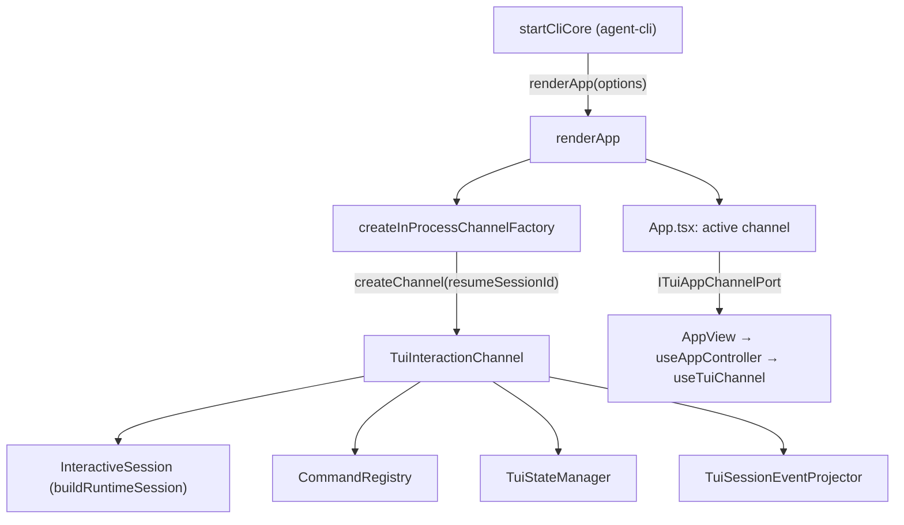
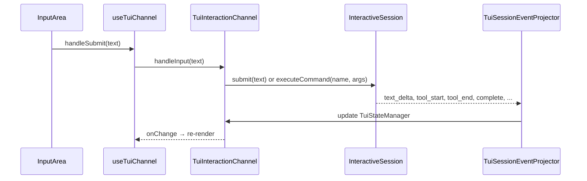

# agent-cli — session ownership in the terminal UI

> Whitebox design for `@robota-sdk/agent-cli`. The blackbox contract lives in
> [`../SPEC.md`](../SPEC.md); nothing here is a promise to a consumer.

## Context & Goal

Which object holds the live `InteractiveSession` in TUI mode, and how React reaches it. These objects
live in `@robota-sdk/agent-ui-terminal`; the CLI only builds the options and calls `renderApp()`. A
user cannot observe this; changing it changes no command, key binding or output.

## Constraints

- The CLI owns no session lifecycle logic — `InteractiveSession` in `@robota-sdk/agent-framework`
  does. A `TuiInteractionChannel` holds one session for its whole life.
- React components never reach the session directly. `App.tsx` receives the channel only as the
  narrowed `ITuiAppChannelPort`, and the controller hooks turn it into a view model.
- In-process, a session switch stops the channel and builds a new one; an existing channel is never
  pointed at another session.

## Internal Structure

### TuiInteractionChannel

`packages/agent-ui-terminal/src/TuiInteractionChannel.ts`. Its constructor builds, once:

1. The session: `buildRuntimeSession(buildTuiSessionOptions(opts))` from agent-framework, which
   constructs `InteractiveSession` from the options the CLI passed to `renderApp()` (provider,
   command modules, host adapters, runners, subagent factory, settings sources and so on).
2. A `CommandRegistry` over the same command modules plus the plugin command source. The UI queries
   it for autocomplete and command lists (`getCommandQueryPort()`); execution always goes through
   the session.
3. A `TuiStateManager` for render state (see [`message-architecture.md`](message-architecture.md)).
4. A `TuiSessionEventProjector`, which subscribes to the session's events when the channel starts
   and unsubscribes when it stops. It feeds streaming, tool, turn, history and execution-workspace
   events into the state manager, and routes `permission_request` and `ask_request` to the channel's
   queues.

At runtime the channel:

- **Starts** by wiring the projector, restoring the history of a resumed session, polling for
  session initialization, then binding and starting the transports (see
  [`composition.md`](composition.md)).
- **Handles input** in `handleInput()`: plain text goes to `session.submit()`; a `/command` goes to
  `session.executeCommand(name, args)` and its result is applied by `applySystemCommandResult()`; an
  unknown command adds a local notice. No `SystemCommandExecutor` is created by the CLI or the UI.
- **Serializes prompts**: `TuiPermissionQueue` holds permission requests and `TuiUserActionQueue`
  holds `askUser` requests, which `PendingActionPrompt` renders. Host actions that a command result
  carries (exit, settings changes, remote control) are executed by the session through
  `ICommandHostAdapters`, not by the channel.
- **Stops** through `TuiChannelLifecycleCoordinator`: graceful session shutdown with a timeout,
  then unwiring, cancelling queued prompts, disposing the state manager and stopping transports.

### App.tsx and the hooks

`App.tsx` owns which channel is active. It creates the first channel for the resumed session id; on a
session switch it stops the current channel and creates a new one, and keys `AppView` by session id
so the view starts fresh. `AppView` calls `useAppController()`, which calls `useTuiChannel(channel)`.
That hook subscribes to channel changes and returns a snapshot plus stable callbacks such as
`handleSubmit`, `handleAbort`, `handleCancelQueue`, `handleStopWaitingLoop` and `handleShutdown`.

The CLI's host services reach components through context: `createProductTuiCliAdapter()`
(`src/startup/tui-presentation.ts`) builds the `ITuiCliAdapter`, and `App.tsx` provides it with
`TuiCliAdapterProvider`. The CLI also passes `createChannelReadyHandler()`
(`src/product/runtime-plumbing.ts`), which receives every channel as it is created — including after a
switch — and points the process guards, the remote-control controller and peer messaging at it.

### Attached terminals

When the terminal attaches to a session that runs in another process (`__PRODUCT_CLI_NAME__ --attach`,
`__PRODUCT_CLI_NAME__ session attach`), `renderAttachedApp()` uses a `WireTuiChannel` that speaks the session
protocol to that host instead. The session lives in the host, and a session switch is the host's.
Both channel types implement `ITuiAppChannelPort`, so the React tree is the same.

### Streaming indicator

`StreamingIndicator` is shown while `isThinking || activeTools.length > 0`. The state manager clears
the streaming text and active tools when a turn starts and again when it ends; after the turn, the
`tool-summary` entry in the transcript lists the tools that ran.

### Plugin hooks

Merging plugin hooks (resolving `${CLAUDE_PLUGIN_ROOT}`, combining hook groups) happens inside
agent-framework (`plugin-hooks-merger.ts`). Neither the CLI nor the terminal UI merges hooks.

## Key Flows

The user-visible result — display order, abort behaviour — is contract; see
[`../SPEC.md`](../SPEC.md).

## Test Approach

In `packages/agent-ui-terminal/src/__tests__/`: `TuiInteractionChannel.lifecycle.test.ts`,
`TuiInteractionChannel.askUser.test.ts`, `tui-channel-lifecycle-coordinator.test.ts` and
`session-switch-channel.test.tsx`.
