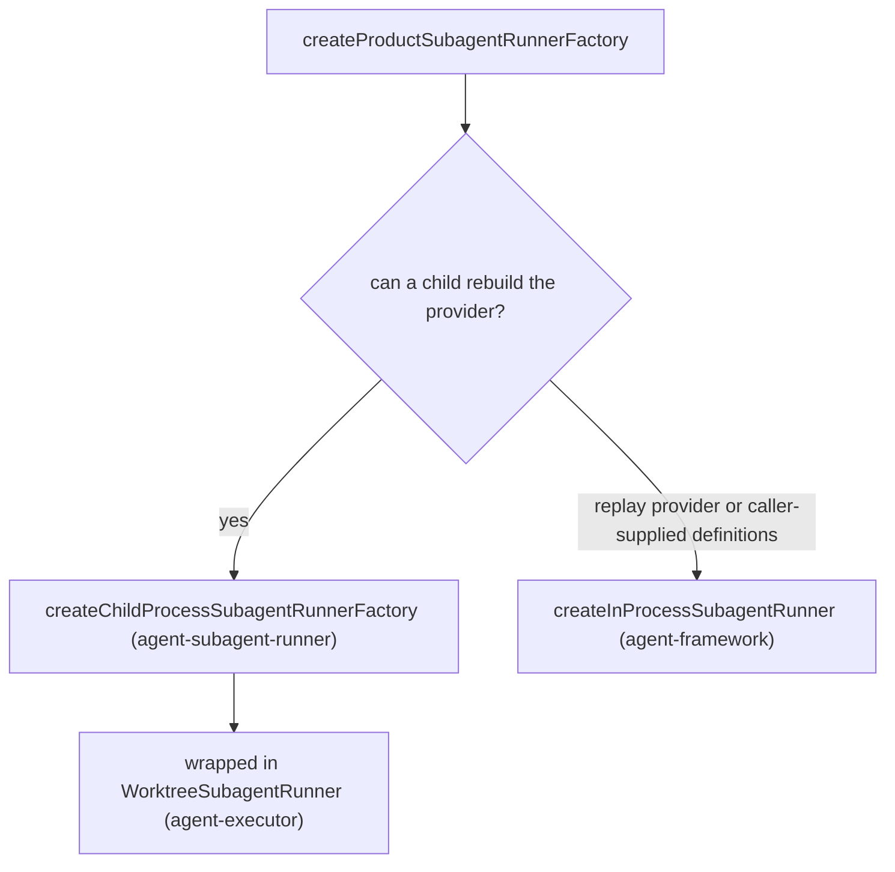
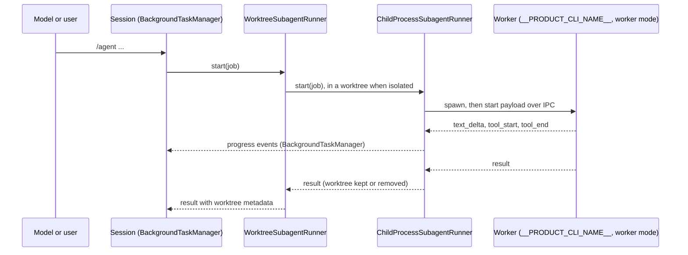

# agent-cli — subagent and background process wiring

> Whitebox design for `@robota-sdk/agent-cli`. The blackbox contract lives in
> [`../SPEC.md`](../SPEC.md); nothing here is a promise to a consumer.

## Context & Goal

What the CLI injects into `InteractiveSession` for background work and subagents, and which package
owns each piece. Subagent lifecycle, the runner port and the agent definition format are specified in
[`agent-framework`'s SPEC](../../../agent-framework/docs/SPEC.md); the runner primitives in
[`agent-executor`'s SPEC](../../../agent-executor/docs/SPEC.md); the child-process runner in
[`agent-subagent-runner`'s SPEC](../../../agent-subagent-runner/docs/SPEC.md). This file covers only
the CLI's part: choosing the runners, telling a child how to start and what to rebuild, and the Git
worktree adapter.

## Constraints

- The CLI owns no subagent or background lifecycle state; `BackgroundTaskManager` in
  `@robota-sdk/agent-executor` does.
- Only serializable data crosses the process boundary. The worker rebuilds its provider, tools and
  sandbox from code, never from serialized objects.
- A child must reproduce its parent. An OS sandbox the child cannot rebuild stops the spawn
  (`assertChildProcessSubagentsCanReproduce()`). A provider it cannot rebuild — a `--session-log`
  replay provider, or provider definitions a caller passed to `startCli()` — makes the session use the
  in-process runner instead, so the subagent runs on the parent's provider without process isolation.
- Agent command behaviour belongs to `@robota-sdk/agent-command`; the terminal UI only renders it.

## Internal Structure

| Piece                                                                     | Owner                                                                | What the CLI supplies                                                                                    |
| ------------------------------------------------------------------------- | -------------------------------------------------------------------- | -------------------------------------------------------------------------------------------------------- |
| Background task runners                                                   | `createDefaultBackgroundTaskRunners()` in agent-executor             | The resolved shell executable                                                                            |
| `BackgroundProcess` tool                                                  | agent-framework (added when a `process` runner is present)           | —                                                                                                        |
| Child-process runner, IPC, transcripts                                    | `createChildProcessSubagentRunnerFactory()` in agent-subagent-runner | Worker entry, provider config and definitions, logs directory, worktree adapter, parent sandbox settings |
| Worktree lifecycle (`WorktreeSubagentRunner`, `ISubagentWorktreeAdapter`) | agent-executor                                                       | `GitWorktreeIsolationAdapter`                                                                            |
| In-process runner                                                         | `createInProcessSubagentRunner` in agent-framework                   | The decision to use it                                                                                   |
| Worker recipe                                                             | `createProductSubagentComposition()` in the CLI                       | —                                                                                                        |

### Background task runners

`src/cli.ts` and `src/headless-bin.ts` pass `createDefaultBackgroundTaskRunners` to `startCliCore()`,
which calls it with the shell from `resolveProductShellExecutable()`. It returns three runners: the
managed shell process runner (`kind: 'process'`), the scheduled task runner (`kind: 'scheduled'`) and
the tool-invocation runner (`kind: 'tool-invocation'`). They enter the product profile, and every mode
receives the instances the assembled product holds (see [`composition.md`](composition.md)). The
framework exposes the process runner to the model as the `BackgroundProcess` tool; the foreground
`Bash` tool is separate.

### Choosing the subagent runner

`createProductSubagentRunnerFactory()` in `src/product/subagent-composition.ts` asks
`selectProductSubagentRunner()` (`src/product/subagent-provider-reproduction.ts`) which runner to use:

For the child-process runner the CLI supplies:

- `workerEntry` from `resolveSelfForkWorkerEntry()` (`src/subagents/self-fork-worker-entry.ts`): how
  to start a copy of the running artifact — the npm bundle, a `tsx` source run, or a Bun single-file
  binary — in worker mode. There is no separate worker file.
- `providerConfig` (the parent's resolved provider settings and model) and `providerDefinitions`.
- `logsDir`: `$PRODUCT_USER_STATE_DIR/logs`.
- `worktreeAdapter`: `createGitWorktreeIsolationAdapter()`.
- Getters for the parent's live OS sandbox settings, so a `/sandbox` change reaches children.

### The worker side

The child is the same binary started with the worker-mode flag. `src/bin.ts` (or
`src/headless-bin.ts`) checks for that flag first and runs
`runSubagentWorkerMain(createProductSubagentComposition())`. The recipe rebuilds, inside the child:
__PRODUCT_CLI_NAME__'s pack tools for the child's working directory (plus the goal tool when the session asks for
it), the hook executors, the provider definitions, the OS sandbox from the parent's current settings,
and the session store a `/fork` job resumes from.

### What the child-process runner does

These are agent-subagent-runner's responsibilities, listed so the wiring above makes sense:

- spawns one worker per job, with the job's execution root (the worktree, when isolated) as its
  working directory;
- waits for the worker's `ready`, then sends the start payload over IPC: the spawn request, agent
  definition, parent config and context, permission mode and provider profile;
- exposes the child `pid` on the job and forwards the worker's text and tool messages as
  `BackgroundTaskManager` progress events;
- lets the worker append its transcript to `<logsDir>/<parentSessionId>/subagents/<taskId>.jsonl`, and
  pages through that file for `/agent read` while the worker is still running;
- forwards follow-up prompts (`send`) and cancellation: an IPC `cancel` first, then `SIGTERM` and
  `SIGKILL` to the worker's process tree after a grace period.

### Worktree isolation

`createChildProcessSubagentRunnerFactory()` wraps the child-process runner in
`WorktreeSubagentRunner` (agent-executor) with the CLI's adapter. The wrapper passes requests without
`isolation: 'worktree'` through unchanged. For isolated requests it:

- prepares a worktree through the adapter and runs the worker in it;
- removes a clean worktree once, whether the job succeeded, failed, failed to start or was cancelled;
- keeps a dirty worktree and returns `worktreePath`, `branchName`, `worktreeStatus`,
  `worktreeNextAction`, `worktreeBaseRevision` and `parentWorktreeStatus` in the result metadata;
- fires the `WorktreeCreate` and `WorktreeRemove` hooks when configured. They are notifications, not
  vetoes: a failing hook is logged and does not stop the job.

`GitWorktreeIsolationAdapter` (`src/subagents/git-worktree-isolation-adapter.ts`) does only the local
Git and filesystem work:

- resolves the repository root from the job's working directory, so a nested directory works; a
  directory outside Git fails with an error that suggests isolation `"none"`;
- creates `$PRODUCT_PROJECT_STATE_DIR/worktrees/<task>-<id>` on a new branch `__PRODUCT_CLI_NAME__/<task>-<id>` from `HEAD`, which also
  works on a detached `HEAD`, and retries with a new short id on a branch or path collision;
- records the base revision and the parent's `git status --porcelain`, so a dirty parent checkout is
  allowed and reported;
- reports whether the worktree has local changes (`git status --porcelain`), and removes it with its
  branch when it is clean;
- runs Git without inherited `GIT_*` variables, so a Git hook's environment cannot redirect it.

### Commands and rendering

A skill with `context: fork` and the `/agent` command both run through
`session.executeCommand(...)`; the SDK and the command modules decide how the work runs. The TUI may
render the `skill-activation` history entry, but it never turns a fork skill into an injected prompt.
When the user asks in conversation to delegate to an agent, the model calls the model-invocable
`/agent` command; the TUI displays the resulting background events and the final answer.

Background job groups are SDK state. The TUI renders group entries from the session's execution
workspace snapshot, but it does not decide when a group is complete, aggregate raw logs, trigger
continuations or own retry and wait behaviour; `/agent wait` and the SDK APIs do. `BackgroundTaskPanel`
lists the visible entries under a `Background work` heading, one row per entry built by
`formatBackgroundTaskRow()` from `IExecutionWorkspaceEntry` data. A new row field must first appear
in the SDK projection before the panel shows it.

## Key Flows

What the user sees and controls — the workspace switcher, `/agent read` — is contract; see
[`../SPEC.md`](../SPEC.md).

## Test Approach

`packages/agent-cli/src/subagents/__tests__/` (Git adapter, self-fork entry) and
`packages/agent-cli/src/product/__tests__/` (`subagent-composition.test.ts`,
`subagent-provider-reproduction.test.ts`) cover the CLI's part.
`packages/agent-subagent-runner/src/__tests__/` covers the runner and IPC payload, and
`packages/agent-executor/src/subagents/__tests__/worktree-subagent-runner.test.ts` covers the worktree
lifecycle.
