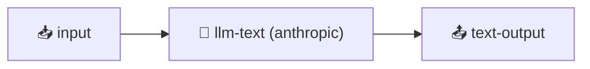

# .dag.md — GitHub Mermaid Rendering as a Viral Channel

`.dag.md` files contain YAML frontmatter with a DAG definition **and** a Mermaid diagram block.
When committed to a GitHub repository, the Mermaid block renders as a visual flowchart —
a zero-friction way to showcase your AI pipeline to other developers.

## How It Works

A `.dag.md` file is both machine-readable (run it with `dag run`) and human-readable (GitHub renders the Mermaid diagram).

````markdown
---
dagId: code-review
description: Automated code review pipeline
dag:
  nodes:
    input:
      nodeType: input
    review:
      nodeType: llm-text
      config:
        provider: anthropic
      dependsOn: [input]
    output:
      nodeType: text-output
      dependsOn: [review]
---

# Code Review Pipeline


````

Run: `dag run code-review.dag.json --input text="$(git diff HEAD~1)"`

````

GitHub renders the Mermaid block as a live diagram. Visitors see your pipeline at a glance —
without reading any code.

## Scaffold with `dag init`

Every `dag init` generates a `hello-world.dag.md` alongside `hello-world.dag.json`:

```bash
dag init
# Creates:
#   .dag/workflows/hello-world.dag.json   ← executable
#   .dag/workflows/hello-world.dag.md    ← GitHub-renderable diagram
````

Commit both files. The `.dag.md` becomes the visual readme for your workflow.

## Generate for Any Workflow

```bash
dag explain .dag/workflows/my-flow.dag.json --format dag-md > my-flow.dag.md
```

## The Viral Loop

1. Developer builds a pipeline with robota-dag
2. Pushes `.dag.md` to GitHub — diagram renders automatically
3. Visitors see the visual flowchart on GitHub → curious → click links → discover robota-dag
4. Developer repeats with new pipelines

## Best Practices

- Put `.dag.md` files in `docs/` or alongside the `.dag.json` they describe
- Include a "Run this workflow" section with the exact `dag run` command
- Link back to the robota-dag repository for discoverability
- Add provider badges or cost estimates in the Markdown body

## File Naming Convention

| File                | Purpose                          |
| ------------------- | -------------------------------- |
| `workflow.dag.json` | Executable DAG definition        |
| `workflow.dag.md`   | GitHub-renderable diagram + docs |

Both files share the same `dagId`. The `.dag.md` is the human-facing companion to the `.dag.json`.

## Running a .dag.md File

`dag run` and `dag explain` both accept `.dag.md` files directly:

```bash
dag run .dag/workflows/hello-world.dag.md --input text="What is a DAG?"
dag explain .dag/workflows/hello-world.dag.md
```

The YAML frontmatter is parsed as the DAG definition; the Mermaid block is ignored at runtime.
