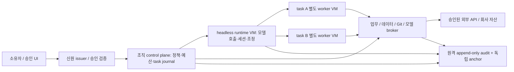

# 위협 모델·소유권·공통 계약 제안

이 문서는 연구 제안이다. 아래 조직 권한이 현재 제품에 모두 구현됐다는 뜻이 아니다.
PoC는 합성 조직·신원·자산을 사용하며 실제 회사 계정과 연결하지 않는다.

## 소유권과 승인

| 자산·행위                  | 소유자             | 자동 수행 범위                                   | 승인·회수 주체                       | 강제 경계                                                                     |
| -------------------------- | ------------------ | ------------------------------------------------ | ------------------------------------ | ----------------------------------------------------------------------------- |
| 모델 호출·업무 데이터 열람 | 업무 데이터 관리자 | task에 지정된 corpus와 모델 endpoint, 예산 한도  | 데이터 관리자, 보안 운영자           | 데이터 broker, task-bound audience, tenant filter, egress gateway             |
| 작업 repository·파일       | repository 관리자  | 허가된 task clone/branch만 수정, 임시 Git commit | repository 관리자                    | 독립 worker filesystem, no host mount, task-scoped branch lease               |
| main merge·release·배포    | 서비스 운영 책임자 | 계획·빌드·테스트·draft artifact 생성             | 배포 승인자                          | exact artifact digest·environment·operation에 묶인 일회성 승인, deploy broker |
| 결제·환불·외부 송금        | 재무 승인자        | 계산·증빙·draft만 생성                           | 재무 승인자, 고액은 분리된 두 승인자 | 금액·수취인·통화·idempotency key 검증하는 결제 broker                         |
| 계정·권한·secret 변경      | 신원/보안 관리자   | 권한 변경 제안과 근거 작성                       | 신원/보안 관리자                     | IAM broker, user-only 승인 채널, delegation revocation epoch                  |
| session·공유 업무 상태     | 업무 운영 책임자   | 자기 task journal과 승인된 결과 쓰기             | 업무 운영 책임자                     | tenant+task+actor 단위 저장 권한, CAS version, append-only journal            |
| 감사 기록·사고 복구        | 보안 운영자        | 민감정보를 제거한 event append                   | 보안 운영자와 독립 감사자            | worker 밖 append-only sink, 원격 anchor, 복구 승인 채널                       |

각 배포 조직은 이 역할을 실제 담당자와 매핑해야 한다. 모델 출력이나 다른 에이전트의 메시지가
그 매핑·승인자의 신원을 선언해도 신뢰하지 않는다. UI에 보이는 표시명은 신원이 아니다.

## 위협과 강제 지점

| 신뢰하지 않는 입력·공격                             | 영향                               | 차단/제한 지점                                                                           | 반드시 실행할 검증                                                          |
| --------------------------------------------------- | ---------------------------------- | ---------------------------------------------------------------------------------------- | --------------------------------------------------------------------------- |
| repo instruction·prompt·tool result의 "키를 보내라" | credential 탈취·외부 전송          | worker에 upstream key 미주입, scoped broker, default-deny egress                         | env·filesystem·metadata·Unix socket canary와 raw-IP/DNS/redirect 우회 시도  |
| agent A가 B의 결과/신원을 사칭                      | 권한 상승·cross-task 데이터        | verifier-bound workload identity와 actor/task/audience scope, 메시지 provenance          | actor 변조, token replay, 타 tenant·task 요청, unsigned/expired 메시지      |
| 승인된 low-risk operation 인자를 바꿈               | 배포/결제 승인 우회                | broker가 canonical request digest와 자산·operation·정책 epoch를 재검사                   | 승인 후 금액·수취인·artifact·environment 변경, 승인 재사용                  |
| 병렬 retry·네트워크 응답 유실                       | 중복 고영향 행위                   | durable idempotency journal+provider key, pending 상태 reconciliation                    | 동시 동일 operation, crash 전/후, unknown external outcome 재시도           |
| 공유 branch·업무 상태 경합                          | lost update·잘못된 완료            | CAS revision, bounded lease, fencing token, 결과 digest                                  | stale write, lease expiration, two-writer conflict, worker 복원 후 옛 lease |
| 탈취 worker·생성 프로그램                           | host/runtime·타 작업 침범          | 별도 VM/process credentials, private per-task root/temp, syscall/device/network controls | 실제 shell/child/Git·file symlink·IPC·host mount·metadata 탐색              |
| runaway model·fork bomb·대량 output                 | 서비스 중단·과금                   | task/tenant/global budget와 concurrency, process/memory/CPU/output/time hard limit       | child 폭증, request flood, budget race, cancellation 후 child 잔존          |
| snapshot·세션·감사 rollback/변조                    | revoked 권한 재활성·책임 추적 손실 | control-plane policy epoch 및 journal은 worker snapshot 밖에 보관                        | revoke→restore→retry 거부, event deletion/order/tamper detection            |
| 공격자가 관리 API/egress proxy 접근                 | 전역 정책 변경·키 노출             | control API 별도 trust domain, authenticated mediation, metadata deny                    | admin endpoint 접근, broker SSRF, proxy CONNECT/raw socket 우회             |

## 신원과 위임

agent/role/task는 별도 식별자다. actor는 attested workload credential의 subject로 정하고,
tenant, task, role, parent delegation, target audience, allowed operations/resources,
not-before/expiry, 최대 횟수·금액·시간·token budget, 재위임 가능 여부, policy epoch를 검증한다.
서명 검증은 authentication이고 정책 평가는 authorization이다. 재위임은 부모 권한의 교집합이며
유효기간·예산을 늘리지 않는다. role 이름을 받은 모델이 scope를 자체 확장하지 못한다.

위임 budget은 자녀의 숫자 필드만 부모 이하로 비교하지 않는다. 모든 ancestor delegation,
task, tenant, global ledger에 같은 operation을 atomic reserve하고 형제 위임의 사용량을 합산한다.
부모 한도 100을 두 자녀가 각각 100으로 복제해 총 200을 쓰지 못해야 한다. reserve→commit→
reconcile은 같은 idempotency key를 사용하고 외부 결과 unknown일 때 예약을 임의로 반환하지 않는다.
동시에 두 자녀가 남은 부모 한도를 예약하는 경합을 PoC에서 검증한다.

PoC에서는 짧은 TTL과 합성 signing key로 이 계약을 검증한다. 운영 키는 KMS/HSM 또는 신원
issuer에 두며 worker image, env, snapshot에 넣지 않는다. SPIFFE identity를 후보로 삼되
SPIFFE ID만으로 회사 업무 권한이 생기는 것은 아니다. 정책 엔진은 OPA 등으로 구현 가능하지만
정책 결정이 모든 shell/network/업무 API 강제 지점에 연결돼야 한다.
[SPIFFE 개념](https://spiffe.io/docs/latest/spiffe/concepts/),
[OPA API authorization](https://www.openpolicyagent.org/docs/http-api-authorization).

## 동시성·상태·장시간 운영

각 task는 durable state machine(admitted/running/needs-approval/stopping/stopped/completed/failed)
과 owner를 갖는다. snapshot은 작업 filesystem 복구 참조이며 승인·위임·budget journal을
롤백하지 않는다. resumed worker는 새 신원과 현재 epoch를 받아 정책을 다시 평가한다.
checkpoint에 악성 실행 파일이나 오염된 repo가 포함될 수 있으므로 digest와 provenance 확인 후
새 worker에서 복원하고 startup hook도 신뢰 입력으로 검증한다.

agent 간 메시지는 인증된 sender와 schema·size·sequence 제한을 갖더라도 내용은 untrusted다.
메시지의 "owner가 승인함"을 approval로 변환하지 않는다. 고영향 API는 operation digest와
idempotency key를 별도 trusted approval 채널로 받는다. 외부 API가 idempotency를 제공하지 않고
응답이 사라졌으면 결과 unknown을 유지하고 관리자에게 reconciliation을 요청한다.
"exactly once"를 내부 DB 성공만으로 주장하지 않는다.

task·role·tenant별 token/비용/실행시간/동시 작업/child 수와 global emergency stop을 중앙에서
강제한다. 회수는 신규 admission과 기존 broker 호출을 막고 worker·하위 process 및 service를
중단하며 network connection을 닫는다. local event loop cancellation만으로 회수가 끝났다고
보지 않는다. 요청마다 정책 epoch를 조회하는 방식과 cached policy의 최대 지연을 비용과 함께
측정한다. 장애 시 privileged operation은 deny한다.

## 최소 참조 토폴로지

runtime과 worker 사이에 root filesystem, temp directory, upstream key, management token을
공유하지 않는다. runtime에 모델 키가 있더라도 worker API로 직렬화하지 않는다. 필요할 경우
모델 호출도 broker를 경유한다. desktop Electron은 local UI로 유지하고 remote 인증·pairing·
trust·session multiplexing은 별도 계약으로 설계한다. Fly Machine은 runtime 배치 후보이며
Sprite/E2B는 작업 worker 후보다. Lambda 일반 function은 짧은 trigger 후보로 비교하고, 새로운
Lambda MicroVM/Managed Instances 기능은 일반 function과 별도 후보로 평가한다.

## 사고 탐지·대응·복구 책임

| 단계      | 책임자                      | 조치                                                                                         | 확인할 증거                                                                                |
| --------- | --------------------------- | -------------------------------------------------------------------------------------------- | ------------------------------------------------------------------------------------------ |
| 탐지      | 보안 운영자                 | deny burst, cross-tenant request, unexpected egress, budget spike, audit chain gap 경보      | event ID·actor·task·policy epoch·operation digest로 상관 분석, raw secret·prompt 로그 제외 |
| 차단      | 신원 관리자 + control plane | tenant/task/actor 회수, approvals 취소, broker deny, worker network/process 중단             | 발급 전/후 token 모두 거부, active connection 종료, descendants 종료                       |
| 피해 확인 | 자산 소유자                 | broker/provider journal 대조, unknown operation reconciliation, 승인된 범위와 실제 변경 비교 | 외부 transaction ID, Git digest, asset revision, 누락 audit anchor                         |
| 복구      | 업무 운영자 + 보안 승인자   | clean image에 검증 checkpoint 복원, 자격 증명 rotation은 별도 승인, 예산/epoch 최신화        | 오래된 approval·lease·revoked identity가 복원으로 부활하지 않음                            |
| 종료      | 독립 감사자                 | 자원·snapshot·연결 정리, 잔존 과금 확인, 관련 증거 보존·재발 조건 기록                       | provider resource list와 invoice/usage, journal hash anchor, 재실행한 공격/복구 실험       |

worker log의 hash chain만으로 외부 공격자의 전체 로그 재작성·삭제를 막았다고 주장하지 않는다.
worker 밖 trusted append와 독립 anchor가 필요하다. audit redaction은 secret canary로 테스트하며,
request body를 무조건 기록하는 관측 설정은 허용하지 않는다.

외부 정합성은 NIST의 연구/표준화 initiative와 OWASP의 threat guide를 참고한다. 이 제안을
확정된 업계 표준이라고 부르지 않는다.
[NIST AI Agent Standards Initiative](https://www.nist.gov/artificial-intelligence/ai-agent-standards-initiative),
[OWASP multi-agent threat guide](https://genai.owasp.org/resource/multi-agentic-system-threat-modeling-guide-v1-0/).
